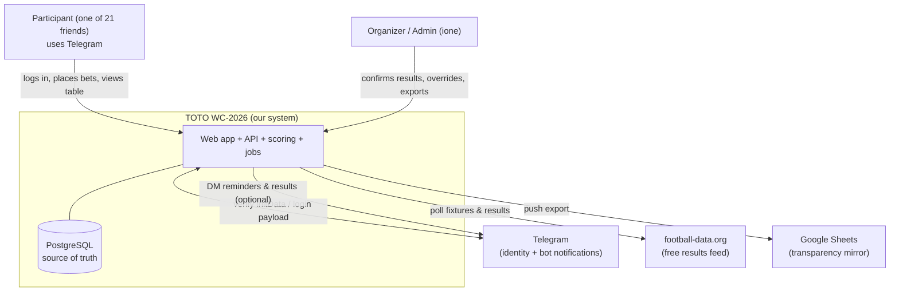
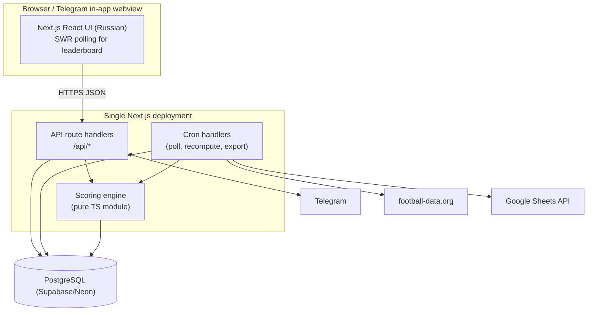
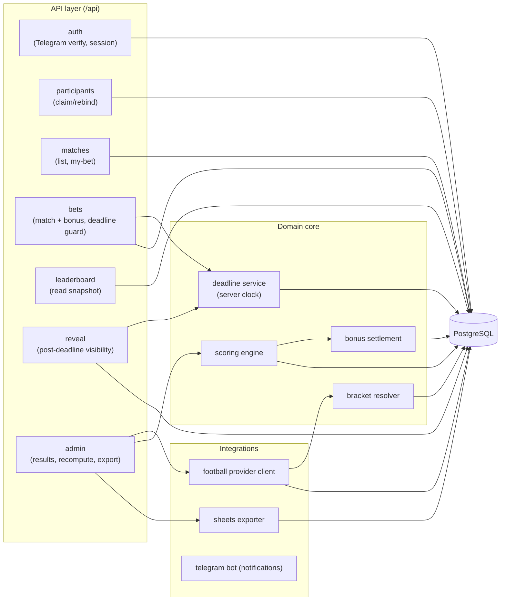
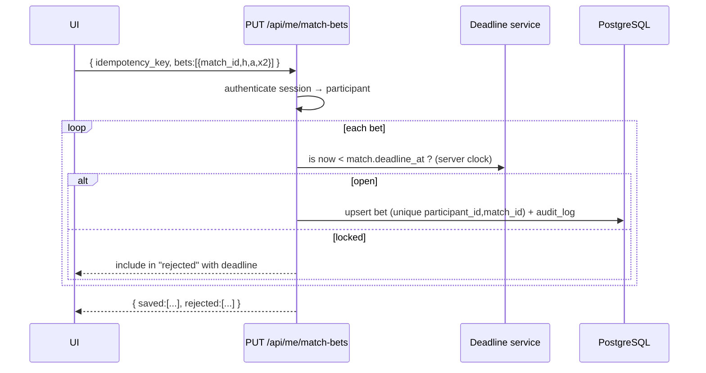
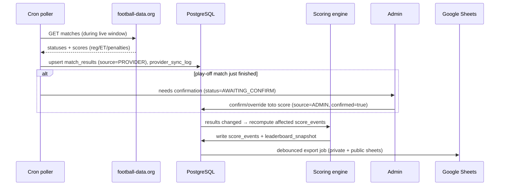
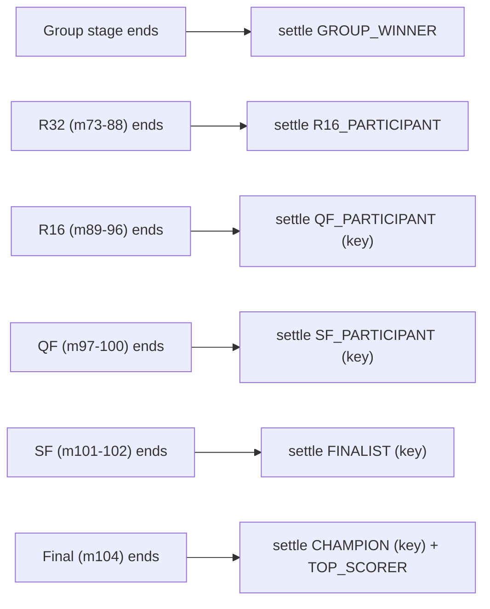
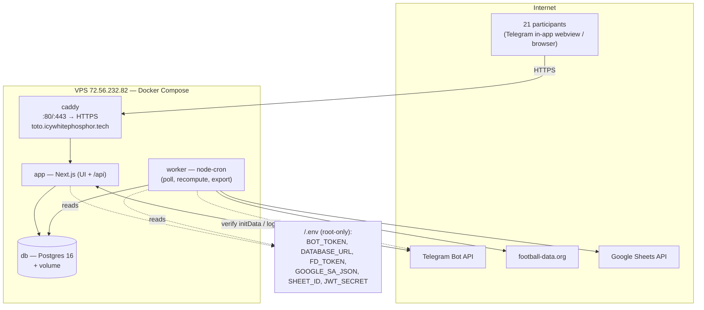

# 02 — Architecture Overview

This document gives the big picture: the C4 diagrams, the stack decision (as an ADR), the two tracks
(pragmatic vs. growth), and the main data flows. Detailed specs live in `04`–`12`.

## 1. System context (C4 level 1)



## 2. Containers (C4 level 2) — Track A (recommended)

One Next.js deployment contains the UI, the API (route handlers), the scoring module, and the scheduled
jobs (via platform cron). One managed Postgres. That's the whole system.



Why a single deployment instead of GPT's separate `web` + `api` services: at 21 users there is no scaling
or team-boundary reason to split them, and one deployment halves the moving parts, the config, and the
cost. The scoring engine is still a **separate module** (its own folder + tests) so it can be extracted
later without rewrite.

## 3. Backend components (C4 level 3)



## 4. Key data flows

### 4.1 Placing a bet (deadline-guarded, idempotent, audited)


### 4.2 Result → scoring → leaderboard → export


### 4.3 Bonus settlement (progressive)


## 5. ADR-001 — Monolith vs. split services

**Status:** Accepted · **Date:** 2026-06-09 · **Deciders:** ione

**Context.** 21 users, 104 matches, one developer, a deadline this week, and a "free-tier" budget. We
must choose the overall shape: a single full-stack app, or GPT's separated `Next.js web` + `NestJS API`
+ `Redis/BullMQ` + `SSE` topology.

### Options

**Option A — Single Next.js app (recommended)**
| Dimension | Assessment |
|-----------|------------|
| Complexity | **Low** — one repo, one deploy, one env |
| Cost | **~$0–5/mo** — fits free tiers |
| Scalability | Fine to thousands of reads; not our constraint |
| Team familiarity | One stack (TS end-to-end) |
| Time-to-ship | **Fastest** |

Pros: minimal moving parts; fastest path to the deadline; cheap; the scoring engine is still modular.
Cons: cron on serverless has cold-start/timeout quirks (mitigated: short jobs, or a tiny always-on
worker); not "impressive" as a reference architecture.

**Option B — Split services + Redis + BullMQ + SSE (GPT's design)**
| Dimension | Assessment |
|-----------|------------|
| Complexity | **High** — 4+ services, queues, pub/sub |
| Cost | Higher (Redis, extra always-on services) |
| Scalability | Excellent — but unneeded at 21 users |
| Team familiarity | More surface area to operate |
| Time-to-ship | **Slowest** |

Pros: textbook-scalable; clean separation; good portfolio piece. Cons: weeks not days; over-built for
the actual load; more to break (queue stuck, Redis down) for a pool that a spreadsheet handled.

### Decision
Adopt **Option A** for delivery. Keep three internal seams clean so Option B remains a *refactor, not a
rewrite*: (1) scoring is a pure module, (2) the football feed is behind a `FootballProvider` interface,
(3) jobs are plain functions a queue could later call. See `14` for the full side-by-side with GPT.

### Consequences
- Easier: shipping on time, operating, reasoning about correctness.
- Harder: true sub-second "goal flash" live updates (we accept 1–3 min freshness; `10` covers the SSE
  upgrade if you ever want it).
- Revisit when: the pool grows past a few hundred users, or you want push notifications at scale.

## 6. Track A vs. Track B at a glance

| Concern | Track A (now) | Track B (growth) |
|---------|---------------|------------------|
| App | One Next.js deploy | `web` + `api` services |
| Jobs | Platform cron / node-cron | Redis + BullMQ workers |
| Live updates | SWR polling (~20–30 s) | SSE / WebSocket push via Redis pub/sub |
| Providers | football-data.org + manual | Multi-provider adapter w/ failover (API-Football, etc.) |
| Leaderboard | Recompute-on-change + snapshot | Materialized view + incremental |
| Observability | Platform logs + Sentry (free) | Full metrics/tracing/alerting |
| When | 21 friends | Hundreds–thousands of users |

## 7. Deployment topology (Track A) — single VPS

The provided target is a **VPS with a fixed IP**, not a serverless platform:

* **Domain:** `toto.icywhitephosphor.tech` → **A record** → **`72.56.232.82`**.
* **TLS:** Caddy terminates HTTPS with an automatic Let's Encrypt certificate (mandatory for Telegram
  auth). Only 80/443 are exposed publicly; Postgres stays on the internal Docker network.
* Because the box is **always-on**, the poller/cron is just a long-running `worker` process — no
  serverless cold-start, timeout, or "max cron frequency" caveats.



Minimal `docker-compose.yml` shape (full version + Caddyfile in `12`):

```yaml
services:
  caddy:   { image: caddy:2, ports: ["80:80","443:443"], depends_on: [app] }     # auto-HTTPS
  app:     { build: ./app, env_file: .env, depends_on: [db] }                     # Next.js
  worker:  { build: ./app, command: ["node","worker.js"], env_file: .env, depends_on: [db] }
  db:      { image: postgres:16, env_file: .env, volumes: ["pgdata:/var/lib/postgresql/data"] }
volumes: { pgdata: {} }
```
```
# Caddyfile
toto.icywhitephosphor.tech {
    reverse_proxy app:3000
}
```

**Managed-Postgres variant:** if you'd rather not self-host the database, drop the `db` service and point
`DATABASE_URL` at Supabase/Neon free — the rest is unchanged. Either way the app + worker live on the VPS.

**Serverless variant (not chosen):** the same app deploys to Vercel/Render with managed Postgres and
platform cron; we keep it as a fallback only because a fixed-IP VPS was provided. See `12` for hosting
choices, secrets handling, backups, firewall, and the monthly cost breakdown.
