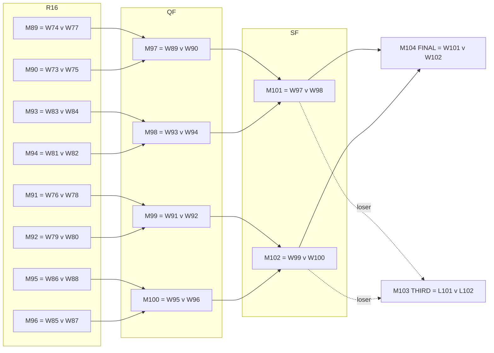

# 03 — Domain Model: WC-2026 Tournament

Everything specific to the 2026 World Cup that the app must encode: the teams, the 12 groups, the
104-match structure, the **Round-of-32 bracket (matches 73–104)**, the "8 best third-placed teams"
mechanic, and how bracket placeholders resolve to real teams. All of this is verified against the
official FIFA final draw and matches your spreadsheet exactly.

## 1. Stage → round mapping (read this first)

The pool's Russian terms predate the 2026 Round of 32. Mapping must be explicit:

| Russian term | `stage` | FIFA name | Match # | Teams in | ×2 |
|--------------|---------|-----------|---------|:--------:|:--:|
| групповой этап | `GROUP` | Group stage | 1–72 | 48 | no |
| 1/16 финала | `R32` | Round of 32 | 73–88 | 32 | yes |
| 1/8 финала | `R16` | Round of 16 | 89–96 | 16 | yes |
| 1/4 финала | `QF` | Quarter-finals | 97–100 | 8 | yes |
| 1/2 финала | `SF` | Semi-finals | 101–102 | 4 | yes |
| матч за 3 место | `THIRD` | Third place | 103 | 2 | yes |
| финал | `FINAL` | Final | 104 | 2 | yes |

> **Critical:** "участники 1/8 финала" (bonus `R16_PARTICIPANT`, 16 teams) = the teams that **reach** the
> Round of 16 = **winners of the Round of 32**. It settles after match 88, *not* after the group stage.

## 2. Teams & groups (seed data — verified vs. official draw)

48 teams, 12 groups of 4. `code` is our internal stable id; `name_ru` is what the UI shows.

| Grp | Pos 1 | Pos 2 | Pos 3 | Pos 4 |
|:---:|-------|-------|-------|-------|
| **A** | Мексика / Mexico | ЮАР / South Africa | Южная Корея / South Korea | Чехия / Czechia |
| **B** | Канада / Canada | Босния / Bosnia & H. | Катар / Qatar | Швейцария / Switzerland |
| **C** | Бразилия / Brazil | Марокко / Morocco | Гаити / Haiti | Шотландия / Scotland |
| **D** | США / USA | Парагвай / Paraguay | Австралия / Australia | Турция / Türkiye |
| **E** | Германия / Germany | Кюрасао / Curaçao | Кот-д'Ивуар / Ivory Coast | Эквадор / Ecuador |
| **F** | Нидерланды / Netherlands | Япония / Japan | Швеция / Sweden | Тунис / Tunisia |
| **G** | Бельгия / Belgium | Египет / Egypt | Иран / Iran | Н. Зеландия / New Zealand |
| **H** | Испания / Spain | Кабо-Верде / Cape Verde | С. Аравия / Saudi Arabia | Уругвай / Uruguay |
| **I** | Франция / France | Сенегал / Senegal | Ирак / Iraq | Норвегия / Norway |
| **J** | Аргентина / Argentina | Алжир / Algeria | Австрия / Austria | Иордания / Jordan |
| **K** | Португалия / Portugal | ДР Конго / Congo DR | Узбекистан / Uzbekistan | Колумбия / Colombia |
| **L** | Англия / England | Хорватия / Croatia | Гана / Ghana | Панама / Panama |

> The four positions above are just listing order, **not** final standings. Each team plays the other
> three in its group once (group stage = `C(4,2) × 12 = 6 × 12 = 72` matches).

## 3. Group stage → who advances

For each group: **1st and 2nd advance** directly. Across all 12 groups, the **8 best-ranked 3rd-placed
teams** also advance → 24 + 8 = **32 teams** into the Round of 32.

Group ranking tie-breakers (FIFA order, needed to compute group winners/runners-up/3rd for bonus
settlement when not taken from the provider): points → goal difference → goals scored → (head-to-head
points, GD, goals among tied teams) → fair-play/conduct points → drawing of lots.

**Ranking of the 12 third-placed teams** (to pick the best 8): points → goal difference → goals scored →
conduct points → FIFA ranking. Bottom 4 third-placed teams are eliminated.

> For our app we **prefer to read the resolved knockout fixtures from the data provider** (it computes
> all of the above for us) and have the admin confirm. The tie-break rules are documented here only so a
> manual fallback is possible.

## 4. The knockout bracket (matches 73–104)

These pairings are **fixed by FIFA**; only the identity of the eight 3rd-placed teams varies. `W-x` =
winner of group x, `RU-x` = runner-up of group x, `3rd(set)` = a specific 3rd-placed team determined by
Annex C (see §5). `Wnn` / `Lnn` = winner / loser of match nn.

### Round of 32 (`R32`, matches 73–88)
| Match | Home slot | Away slot |
|:-----:|-----------|-----------|
| 73 | RU-A | RU-B |
| 74 | W-E | 3rd(A/B/C/D/F) |
| 75 | W-F | RU-C |
| 76 | W-C | RU-F |
| 77 | W-I | 3rd(C/D/F/G/H) |
| 78 | RU-E | RU-I |
| 79 | W-A | 3rd(C/E/F/H/I) |
| 80 | W-L | 3rd(E/H/I/J/K) |
| 81 | W-D | 3rd(B/E/F/I/J) |
| 82 | W-G | 3rd(A/E/H/I/J) |
| 83 | RU-K | RU-L |
| 84 | W-H | RU-J |
| 85 | W-B | 3rd(E/F/G/I/J) |
| 86 | W-J | RU-H |
| 87 | W-K | 3rd(D/E/I/J/L) |
| 88 | RU-D | RU-G |

### Round of 16 (`R16`, matches 89–96)
| Match | Home | Away |
|:-----:|------|------|
| 89 | W74 | W77 |
| 90 | W73 | W75 |
| 91 | W76 | W78 |
| 92 | W79 | W80 |
| 93 | W83 | W84 |
| 94 | W81 | W82 |
| 95 | W86 | W88 |
| 96 | W85 | W87 |

### Quarter-finals (`QF`, 97–100), Semi-finals (`SF`, 101–102), Third (103), Final (104)
| Match | Home | Away |
|:-----:|------|------|
| 97 | W89 | W90 |
| 98 | W93 | W94 |
| 99 | W91 | W92 |
| 100 | W95 | W96 |
| 101 | W97 | W98 |
| 102 | W99 | W100 |
| 103 (THIRD) | L101 | L102 |
| 104 (FINAL) | W101 | W102 |

### Bracket diagram (R16 → Final)


## 5. Resolving the third-placed slots (the "495 combinations")

The eight 3rd-placed qualifiers can come from any 8 of the 12 groups → **C(12,8) = 495** combinations.
FIFA's **Annex C** maps each combination to a fixed assignment of which 3rd-placed team goes to matches
**74, 77, 79, 80, 81, 82, 85, 87**. (Note: only those eight R32 matches host a 3rd-placed team; the
other eight are winner-vs-runner-up.)

Two ways to resolve this in the app:

**Recommended — provider-driven + admin confirm.** Once the group stage finishes, football-data.org (and
any real provider) publishes the resolved R32 fixtures with actual team ids, keyed by **FIFA match
number (73–88)**, which is stable. We match on `fifa_match_no`, fill in `home_team_id` / `away_team_id`,
and the admin confirms. No need to host the 495-row matrix at all. The same applies round-by-round for
R16→Final (winners propagate as matches finish).

**Fallback — encode Annex C.** If you want the app to resolve the bracket itself (e.g. provider lag),
store Annex C as static data:

```ts
// 495 rows. Key = the 8 groups (sorted) that produced a 3rd-placed qualifier.
// Value = which group's 3rd-placed team fills each of the 8 third-place R32 slots.
type ThirdPlaceCombo = {
  groups: string;                 // e.g. "ABCDEFGH" (sorted, 8 of A..L)
  assign: {                       // group letter whose 3rd-placed team plays here
    m74: string; m77: string; m79: string; m80: string;
    m81: string; m82: string; m85: string; m87: string;
  };
};
// Example row (combo #495 = groups A,B,C,D,E,F,G,H):
// { groups:"ABCDEFGH", assign:{ m74:"H", m77:"G", m79:"B", m80:"C", m81:"A", m82:"F", m85:"D", m87:"E" } }
```

The full table is published in the FIFA tournament regulations (Annex C) and mirrored on Wikipedia's
knockout-stage page. Loading it is a one-off; we **default to provider-driven resolution** and treat the
matrix as an optional offline safeguard.

## 6. How the bracket connects to bonus settlement

| Bonus category | "Actual set" after settlement | Source |
|----------------|-------------------------------|--------|
| `GROUP_WINNER` | the 12 teams finishing **1st** in their group | provider standings / admin |
| `R16_PARTICIPANT` | the 16 winners of matches 73–88 | match_results |
| `QF_PARTICIPANT` | the 8 winners of matches 89–96 | match_results |
| `SF_PARTICIPANT` | the 4 winners of matches 97–100 | match_results |
| `FINALIST` | the 2 winners of matches 101–102 | match_results |
| `CHAMPION` | the winner of match 104 | match_results |
| `TOP_SCORER` | the official Golden Boot player | provider scorers / admin (tie ruling — see `01` §7.1) |

This is why the leaderboard fills in bonus points progressively (see `05` settlement triggers).

## 7. Tournament calendar (for deadlines & the build timeline)

- **Group stage:** 11–27 June 2026 (matches 1–72).
- **Round of 32:** 28 June – 3 July (73–88).
- **Round of 16:** 4–7 July (89–96).
- **Quarter-finals:** 9–11 July (97–100).
- **Semi-finals:** 14–15 July (101–102).
- **Third place:** 18 July (103). **Final:** 19 July (104), MetLife Stadium.
- **Bonus-bet deadline:** 10 June 23:00 MSK (before match 1).

Exact kickoff times come from the provider import; match deadlines are derived as `kickoff − 3h` (see
`11`). Treat the per-round date ranges above as approximate windows for planning, not as bet deadlines.

## 8. Sources
- [Wikipedia: 2026 FIFA World Cup knockout stage](https://en.wikipedia.org/wiki/2026_FIFA_World_Cup_knockout_stage)
  (match 73–104 slot definitions, 495-combination Annex C).
- [Wikipedia: 2026 FIFA World Cup](https://en.wikipedia.org/wiki/2026_FIFA_World_Cup) (format, third-place ranking).
- [FIFA — groups, qualification & tie-breakers](https://www.fifa.com/en/tournaments/mens/worldcup/canadamexicousa2026/articles/groups-how-teams-qualify-tie-breakers).
- Group composition cross-checked against your `тотоЧМ2026.xlsx` («бонусные ставки» sheet) — exact match.
