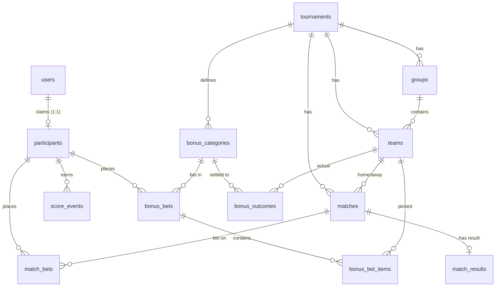

# 04 — Data Model

PostgreSQL is the **source of truth**. This document gives the full schema (DDL), the ER diagram, the
key constraints that enforce fairness, and the seed data. Table/column names here are canonical — every
other doc uses them verbatim.

## 1. ER diagram



## 2. Identity & roster

```sql
-- A Telegram account.
CREATE TABLE users (
  id              uuid PRIMARY KEY DEFAULT gen_random_uuid(),
  telegram_id     bigint UNIQUE NOT NULL,
  username        text,
  first_name      text,
  last_name       text,
  photo_url       text,
  is_admin        boolean NOT NULL DEFAULT false,
  created_at      timestamptz NOT NULL DEFAULT now(),
  last_login_at   timestamptz
);

-- The fixed 21-person roster. user_id is NULL until the person claims their name.
CREATE TABLE participants (
  id              uuid PRIMARY KEY DEFAULT gen_random_uuid(),
  user_id         uuid UNIQUE REFERENCES users(id),         -- one Telegram ↔ one participant
  roster_no       int  UNIQUE NOT NULL,                     -- 1..21 from the spreadsheet
  display_name    text UNIQUE NOT NULL,                     -- "Гулькин Иван"
  status          text NOT NULL DEFAULT 'ACTIVE'
                    CHECK (status IN ('ACTIVE','DISABLED')),
  tiebreak_rank   int,                                      -- manual "по росту" order; NULL = use fallback
  created_at      timestamptz NOT NULL DEFAULT now()
);
```

The roster is an **allow-list**: a person can only claim a pre-seeded `display_name`, so strangers can't
create participants. See `07` for the claim flow.

## 3. Tournament, groups, teams

```sql
CREATE TABLE tournaments (
  id                   text PRIMARY KEY,                    -- 'wc2026'
  name                 text NOT NULL,
  display_tz           text NOT NULL DEFAULT 'Europe/Moscow',
  bonus_deadline_at    timestamptz NOT NULL,                -- 2026-06-10 20:00:00Z (= 23:00 MSK)
  match_deadline_lead  interval NOT NULL DEFAULT '3 hours',
  starts_at            timestamptz,
  ends_at              timestamptz
);

CREATE TABLE groups (
  tournament_id   text NOT NULL REFERENCES tournaments(id),
  code            text NOT NULL,                            -- 'A'..'L'
  name            text,
  PRIMARY KEY (tournament_id, code)
);

CREATE TABLE teams (
  id                uuid PRIMARY KEY DEFAULT gen_random_uuid(),
  tournament_id     text NOT NULL REFERENCES tournaments(id),
  group_code        text NOT NULL,
  code              text NOT NULL,                          -- stable internal: 'MEX','RSA'...
  name_ru           text NOT NULL,                          -- UI label
  name_en           text NOT NULL,
  fifa_code         text,                                   -- 'MEX'
  provider_team_id  text,                                   -- football-data.org team id
  logo_url          text,
  UNIQUE (tournament_id, code),
  FOREIGN KEY (tournament_id, group_code) REFERENCES groups(tournament_id, code)
);
CREATE INDEX ON teams (tournament_id, group_code);
CREATE INDEX ON teams (provider_team_id);
```

## 4. Matches & results

```sql
CREATE TABLE matches (
  id                uuid PRIMARY KEY DEFAULT gen_random_uuid(),
  tournament_id     text NOT NULL REFERENCES tournaments(id),
  fifa_match_no     int  NOT NULL,                          -- 1..104 (stable bracket key)
  stage             text NOT NULL
                      CHECK (stage IN ('GROUP','R32','R16','QF','SF','THIRD','FINAL')),
  group_code        text,                                   -- only for GROUP
  -- Teams may be unknown until the bracket resolves; slot strings hold the placeholder.
  home_team_id      uuid REFERENCES teams(id),
  away_team_id      uuid REFERENCES teams(id),
  home_slot         text,                                   -- 'W-A','RU-B','3RD:A/B/C/D/F','W73','L101'
  away_slot         text,
  kickoff_at        timestamptz,                            -- from provider; may be TBD early
  deadline_at       timestamptz,                            -- = kickoff_at - tournament.match_deadline_lead
  venue             text,
  city              text,
  status            text NOT NULL DEFAULT 'SCHEDULED'
                      CHECK (status IN ('SCHEDULED','LIVE','AWAITING_CONFIRM','FINAL','CANCELLED')),
  x2_allowed        boolean NOT NULL DEFAULT false,         -- true for R32..FINAL
  provider_match_id text,
  created_at        timestamptz NOT NULL DEFAULT now(),
  updated_at        timestamptz NOT NULL DEFAULT now(),
  UNIQUE (tournament_id, fifa_match_no)
);
CREATE INDEX ON matches (stage);
CREATE INDEX ON matches (kickoff_at);
CREATE INDEX ON matches (deadline_at);
CREATE INDEX ON matches (status);

-- One result row per match. Stores the breakdown AND the canonical "toto" score.
CREATE TABLE match_results (
  match_id          uuid PRIMARY KEY REFERENCES matches(id),
  result_status     text NOT NULL
                      CHECK (result_status IN ('SCHEDULED','LIVE','FT','AET','PEN','CANCELLED')),
  base_home         int,    -- goals at the end of played time (90' for GROUP; after ET for play-off)
  base_away         int,
  pen_home          int,    -- penalty shootout score (NULL if none)
  pen_away          int,
  toto_home         int,    -- canonical score used for scoring (see 05 §canonical)
  toto_away         int,
  winner_team_id    uuid REFERENCES teams(id),              -- NULL only for a genuine group draw
  source            text NOT NULL DEFAULT 'PROVIDER'
                      CHECK (source IN ('PROVIDER','ADMIN')),
  confirmed         boolean NOT NULL DEFAULT false,         -- play-off must be confirmed before scoring
  provider_payload  jsonb,
  updated_by        uuid REFERENCES users(id),
  updated_at        timestamptz NOT NULL DEFAULT now()
);
```

**Why `base_*` + `pen_*` + `toto_*`:** the provider gives us the breakdown (regulation, extra time,
penalties); the scoring engine needs one decisive number pair. We persist both so the canonical
computation is auditable and a human can verify it. For group matches `pen_*` is NULL and
`toto = base`. (See `05` §canonical and `08` §mapping.)

## 5. Bets

```sql
CREATE TABLE match_bets (
  id              uuid PRIMARY KEY DEFAULT gen_random_uuid(),
  participant_id  uuid NOT NULL REFERENCES participants(id),
  match_id        uuid NOT NULL REFERENCES matches(id),
  pred_home       int  NOT NULL CHECK (pred_home  >= 0 AND pred_home  <= 99),
  pred_away       int  NOT NULL CHECK (pred_away  >= 0 AND pred_away  <= 99),
  x2              boolean NOT NULL DEFAULT false,
  -- Optional UX (open question 01 §7.3): if the player enters a draw for a play-off,
  -- they also pick who wins the shootout, and we derive the toto bet from it.
  pen_winner      text CHECK (pen_winner IN ('HOME','AWAY')),
  submitted_at    timestamptz NOT NULL DEFAULT now(),
  updated_at      timestamptz NOT NULL DEFAULT now(),
  version         int NOT NULL DEFAULT 1,
  UNIQUE (participant_id, match_id)
);
CREATE INDEX ON match_bets (match_id);
```
Server-side invariants (enforced in the API, since they need cross-table / time checks): `x2` may be
true only when the match `stage` allows it; a write is rejected if `now() >= matches.deadline_at`;
`pen_winner` is only meaningful for play-off draws. See `06`.

```sql
CREATE TABLE bonus_categories (
  id                  text PRIMARY KEY,                     -- 'GROUP_WINNER'...
  tournament_id       text NOT NULL REFERENCES tournaments(id),
  name_ru             text NOT NULL,
  name_en             text NOT NULL,
  item_count          int  NOT NULL,                        -- 12,16,8,4,2,1,1
  points_per_correct  int  NOT NULL,                        -- 3,5,7,8,10,12,7
  is_key_tiebreaker   boolean NOT NULL DEFAULT false,
  settles_after_stage text NOT NULL,                        -- 'GROUP','R32','R16','QF','SF','FINAL'
  item_type           text NOT NULL CHECK (item_type IN ('TEAM','PLAYER')),
  sort_order          int  NOT NULL
);

CREATE TABLE bonus_bets (
  id              uuid PRIMARY KEY DEFAULT gen_random_uuid(),
  participant_id  uuid NOT NULL REFERENCES participants(id),
  category_id     text NOT NULL REFERENCES bonus_categories(id),
  submitted_at    timestamptz NOT NULL DEFAULT now(),
  updated_at      timestamptz NOT NULL DEFAULT now(),
  locked_at       timestamptz,
  UNIQUE (participant_id, category_id)
);

CREATE TABLE bonus_bet_items (
  id              uuid PRIMARY KEY DEFAULT gen_random_uuid(),
  bonus_bet_id    uuid NOT NULL REFERENCES bonus_bets(id) ON DELETE CASCADE,
  team_id         uuid REFERENCES teams(id),               -- for TEAM categories
  player_name     text,                                    -- for TOP_SCORER
  position        int  NOT NULL DEFAULT 0,
  CHECK ((team_id IS NOT NULL) <> (player_name IS NOT NULL)),  -- exactly one
  UNIQUE (bonus_bet_id, team_id)                            -- no duplicate team in a category
);

-- The actual correct answers per category, written at settlement time.
CREATE TABLE bonus_outcomes (
  id            uuid PRIMARY KEY DEFAULT gen_random_uuid(),
  category_id   text NOT NULL REFERENCES bonus_categories(id),
  team_id       uuid REFERENCES teams(id),
  player_name   text,
  settled_at    timestamptz NOT NULL DEFAULT now(),
  CHECK ((team_id IS NOT NULL) <> (player_name IS NOT NULL)),
  UNIQUE (category_id, team_id)
);
```

## 6. Scoring ledger & leaderboard

```sql
-- One current row per (participant, scorable unit). Recompute upserts; never trust client math.
CREATE TABLE score_events (
  id              uuid PRIMARY KEY DEFAULT gen_random_uuid(),
  participant_id  uuid NOT NULL REFERENCES participants(id),
  source          text NOT NULL CHECK (source IN ('MATCH','BONUS')),
  unit_key        text NOT NULL,             -- 'M:<match_id>' or 'B:<category_id>'
  match_id        uuid REFERENCES matches(id),
  category_id     text REFERENCES bonus_categories(id),
  stage           text,                      -- match stage or settles_after_stage
  points          int  NOT NULL,
  detail          jsonb,                     -- {exact:false, outcome:true, x2:true, base:..} for audit
  computed_at     timestamptz NOT NULL DEFAULT now(),
  UNIQUE (participant_id, unit_key)
);
CREATE INDEX ON score_events (participant_id);

-- Standings as a view (full recompute is trivial at 21×~111 units).
CREATE VIEW v_standings AS
SELECT
  p.id   AS participant_id,
  p.display_name,
  COALESCE(SUM(se.points), 0)                                              AS total_points,
  COALESCE(SUM(se.points) FILTER (WHERE se.source='MATCH'), 0)             AS match_points,
  COALESCE(SUM(se.points) FILTER (WHERE se.source='BONUS'), 0)             AS bonus_points,
  COALESCE(SUM(se.points) FILTER (
    WHERE se.source='MATCH' AND se.stage IN ('R32','R16','QF','SF','THIRD','FINAL')), 0)
                                                                           AS playoff_match_points,
  COALESCE(SUM(se.points) FILTER (
    WHERE se.source='BONUS' AND se.category_id IN
      ('QF_PARTICIPANT','SF_PARTICIPANT','FINALIST','CHAMPION')), 0)       AS key_bonus_points,
  p.tiebreak_rank
FROM participants p
LEFT JOIN score_events se ON se.participant_id = p.id
WHERE p.status = 'ACTIVE'
GROUP BY p.id;
-- Ranking applies the 4-level order in 05 §tie-breakers on top of this view.

-- Cached JSON snapshots for the live endpoint + history of how the table evolved.
CREATE TABLE leaderboard_snapshots (
  id            uuid PRIMARY KEY DEFAULT gen_random_uuid(),
  tournament_id text NOT NULL REFERENCES tournaments(id),
  generated_at  timestamptz NOT NULL DEFAULT now(),
  rows          jsonb NOT NULL,             -- ranked rows incl. place, breakdown, prize
  reason        text                        -- 'match 73 confirmed', etc.
);
CREATE INDEX ON leaderboard_snapshots (tournament_id, generated_at DESC);
```

## 7. Audit & integration logs

```sql
CREATE TABLE audit_log (
  id            uuid PRIMARY KEY DEFAULT gen_random_uuid(),
  actor_user_id uuid REFERENCES users(id),
  actor_kind    text NOT NULL CHECK (actor_kind IN ('USER','ADMIN','SYSTEM')),
  action        text NOT NULL,             -- 'BET_UPSERT','RESULT_OVERRIDE','RECOMPUTE','EXPORT'...
  entity_type   text NOT NULL,             -- 'match_bet','bonus_bet','match_result'...
  entity_id     text,
  before        jsonb,
  after         jsonb,
  reason        text,
  ip            inet,
  user_agent    text,
  created_at    timestamptz NOT NULL DEFAULT now()
);
CREATE INDEX ON audit_log (entity_type, entity_id, created_at DESC);

CREATE TABLE provider_sync_log (
  id              uuid PRIMARY KEY DEFAULT gen_random_uuid(),
  provider        text NOT NULL,            -- 'football-data.org'
  endpoint        text NOT NULL,
  request_params  jsonb,
  http_status     int,
  items           int,
  ok              boolean NOT NULL,
  error           text,
  quota_remaining int,                      -- from X-Requests-Available-Minute header
  started_at      timestamptz NOT NULL DEFAULT now(),
  finished_at     timestamptz
);

CREATE TABLE sheet_export_log (
  id          uuid PRIMARY KEY DEFAULT gen_random_uuid(),
  mode        text NOT NULL CHECK (mode IN ('FULL','AUDIT_APPEND')),
  target      text NOT NULL,                -- 'private' | 'public'
  ranges      jsonb,
  rows        int,
  ok          boolean NOT NULL,
  error       text,
  started_at  timestamptz NOT NULL DEFAULT now(),
  finished_at timestamptz
);
```

Sessions: Track A uses a **stateless JWT in an httpOnly, Secure, SameSite cookie**, so no sessions table
is required. If you want server-side revocation, add `sessions(id, user_id, created_at, expires_at,
revoked_at)` and check it in the auth middleware (optional).

## 8. Seed data

Insert once at setup:

1. **`tournaments`** — `('wc2026', 'FIFA World Cup 2026', 'Europe/Moscow', '2026-06-10T20:00:00Z', '3 hours', '2026-06-11', '2026-07-19')`.
2. **`groups`** — A…L.
3. **`teams`** — 48 rows from `03` §2 (`code`, `name_ru`, `name_en`, `group_code`).
4. **`bonus_categories`** — the 7 rows from `00` §2.3 (ids, counts, points, key flag, `settles_after_stage`, `item_type`, `sort_order`).
5. **`matches`** — 104 rows. Group matches get `home_team_id`/`away_team_id`; knockout matches start
   with `home_slot`/`away_slot` from `03` §4 and resolve later. `kickoff_at`/`venue` filled by the
   provider import (`08`).
6. **`participants`** — the 21 names from your sheet, with `roster_no` 1…21, `user_id` NULL:
   Вишневский Дмитрий, Гололобов Максим, Гнатенко Артём, Грабовский Ярослав, Гулькин Иван, Гулькин
   Сергей, Думнов Александр, Епанчинцев Александр, Иванов Евгений, Ковальчук Артём, Котляров Яков,
   Ларин Иван, Оробинский Станислав, Перцев Роман, Решетников Дмитрий, Сошин Ярослав, Судаков Михаил,
   Сушко Евгений, Хайкинсон Александр, Шумаков Юрий, Якунькин Александр.

Designate the admin by setting `users.is_admin = true` after that person logs in and claims their name
(e.g. Гулькин Иван), or pre-mark by `telegram_id`.

## 9. Constraints that enforce fairness (summary)

| Rule | Mechanism |
|------|-----------|
| One Telegram ↔ one participant | `users.telegram_id UNIQUE`, `participants.user_id UNIQUE` |
| One bet per participant per match | `match_bets UNIQUE(participant_id, match_id)` |
| One bonus bet per participant per category | `bonus_bets UNIQUE(participant_id, category_id)` |
| No duplicate team within a bonus category | `bonus_bet_items UNIQUE(bonus_bet_id, team_id)` |
| Exactly one of team/player per bonus item | `CHECK ((team_id IS NOT NULL) <> (player_name IS NOT NULL))` |
| Non-negative, sane scores | `CHECK (pred_home/away BETWEEN 0 AND 99)` |
| Deadlines, ×2-stage, item counts | enforced in the API (need server time / cross-table) — see `06` |
| Every change traceable | `audit_log` before/after on every write |
