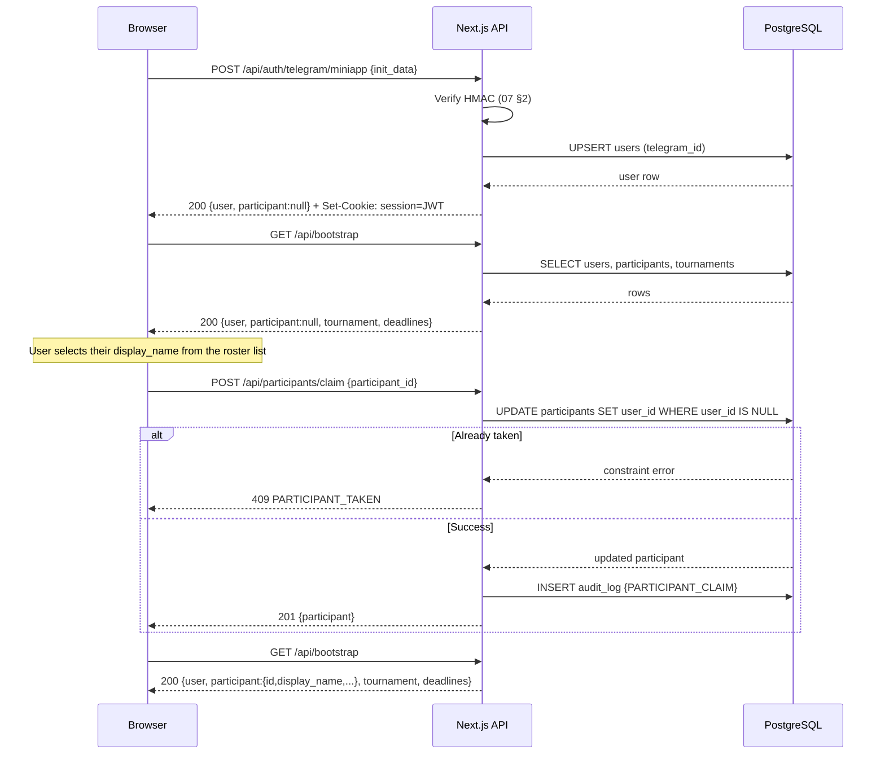
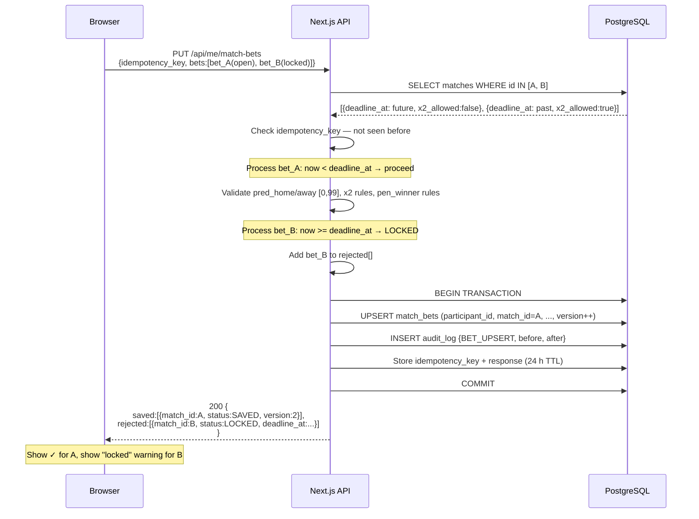

# 06 — Internal REST API Specification

Full specification for every HTTP endpoint exposed by the Next.js App Router backend. The end-user UI is
in Russian; all identifiers, field names, and error codes are in English (see `00` §language policy).

Scoring rules are not restated here — see `05`. Deadline edge cases are in `11`. Telegram auth details
are in `07`. Time-zone model is in `11` §1.

---

## 1. Conventions

### 1.1 Base URL

```
https://toto.icywhitephosphor.tech/api
```

All paths below are relative to this base. HTTP only on port 80 is rejected by Caddy; all traffic is
HTTPS.

### 1.2 Data format

- All request and response bodies are `application/json; charset=utf-8`.
- All timestamps are **ISO 8601 UTC** strings, e.g. `"2026-06-11T17:00:00.000Z"`.
- Every response (success or error) includes a `"server_time"` field at the top level — the server's
  current UTC time at the moment the response was built. Clients use this to calibrate their local
  deadline timers.
- `null` fields are included explicitly rather than omitted, so clients can distinguish "not set" from
  "field absent / older API version".

### 1.3 Authentication

Identity is carried by a **JWT in an `httpOnly + Secure + SameSite=Lax` cookie** named `session`.
The cookie is issued by the `/api/auth/*` endpoints and sent automatically on same-origin requests.

Three caller roles are recognized:

| Role | Condition |
|------|-----------|
| `public` | No valid session cookie (unauthenticated) |
| `participant` | Valid JWT, `users.is_admin = false` |
| `admin` | Valid JWT, `users.is_admin = true` |

Admin is a superset of participant. Endpoints that require `participant` also accept `admin`.

### 1.4 Standard status codes

| Code | Meaning |
|------|---------|
| `200 OK` | Success (GET, PATCH with body; idempotent PUT with saved items) |
| `201 Created` | New resource created (POST /api/participants/claim on first call) |
| `400 Bad Request` | Malformed JSON, missing required field, value out of range |
| `401 Unauthorized` | No session cookie or JWT expired / invalid |
| `403 Forbidden` | Session valid but role insufficient, or reveal requested before deadline |
| `409 Conflict` | Unique constraint violation (e.g. claim already taken by another user) |
| `422 Unprocessable Entity` | Semantically invalid: e.g. x2 on a group match, wrong item count |
| `423 Locked` | Deadline passed — the resource is locked; body contains `deadline_at` |
| `429 Too Many Requests` | Rate limit hit; body contains `retry_after_s` |
| `500 Internal Server Error` | Unexpected server error; body contains a request id for log lookup |

### 1.5 Error envelope

Every non-2xx response uses this shape:

```json
{
  "server_time": "2026-06-11T17:05:22.341Z",
  "error": {
    "code": "DEADLINE_PASSED",
    "message": "Match deadline has passed",
    "detail": { "deadline_at": "2026-06-11T14:00:00.000Z" }
  }
}
```

`error.code` is a machine-readable constant (see §6). `error.message` is English prose. `error.detail`
is optional structured context.

### 1.6 Rate limiting

Limits are enforced per IP for unauthenticated endpoints and per user-id for authenticated ones.

| Tier | Limit | Window |
|------|-------|--------|
| Auth endpoints (`/api/auth/*`) | 10 req | 60 s per IP |
| Participant read/write (`/api/me/*`) | 120 req | 60 s per user |
| Admin endpoints (`/api/admin/*`) | 60 req | 60 s per user |
| All other endpoints | 60 req | 60 s per IP (unauth) / per user (auth) |

When a limit is exceeded the server responds with `429` and a body including `"retry_after_s": <n>`.

---

## 2. Endpoint index

| Method | Path | Auth | Purpose |
|--------|------|------|---------|
| POST | `/api/auth/telegram/miniapp` | public | Verify Mini App `initData`, issue session |
| POST | `/api/auth/telegram/widget` | public | Verify Login Widget callback, issue session |
| POST | `/api/auth/logout` | participant | Clear session cookie |
| GET | `/api/bootstrap` | public | App boot payload: user, participant, tournament, deadlines |
| POST | `/api/participants/claim` | participant | Bind authenticated user to a roster participant |
| GET | `/api/matches` | public | List matches (filterable by stage, date range) |
| GET | `/api/matches/:id` | public | Single match detail |
| PUT | `/api/me/match-bets` | participant | Batch upsert match bets (partial-save, idempotent) |
| GET | `/api/me/bonus-bets` | participant | Read caller's bonus bets |
| PUT | `/api/me/bonus-bets` | participant | Write all 7 bonus categories atomically |
| GET | `/api/leaderboard` | public | Current ranked standings (latest snapshot) |
| GET | `/api/leaderboard/stream` | public | SSE stream of leaderboard updates (Track B option) |
| GET | `/api/matches/:id/bets` | participant | Reveal all participants' bets for one match (post-deadline) |
| GET | `/api/bonus/reveal` | participant | Reveal all participants' bonus bets (post-bonus-deadline) |
| POST | `/api/admin/import/fixtures` | admin | Import match fixture list from provider |
| PATCH | `/api/admin/matches/:id/result` | admin | Set or override a match result |
| POST | `/api/admin/recalculate` | admin | Trigger full scoring recompute |
| POST | `/api/admin/export/sheets` | admin | Push current state to Google Sheets |
| GET | `/api/admin/provider/status` | admin | Last provider sync status and quota |
| POST | `/api/admin/participants/:id/rebind` | admin | Rebind a participant to a different Telegram user |
| PATCH | `/api/admin/bonus/:category/settle` | admin | Record actual outcome for a bonus category |

---

## 3. Endpoint specifications

### 3.1 POST /api/auth/telegram/miniapp

**Purpose:** Authenticate via Telegram Mini App. The client passes the raw `initData` string that
Telegram injects into the Mini App WebView. The server verifies the HMAC per the Telegram docs
(see `07` §2) and issues a session cookie.

**Auth:** public

**Request body:**

```json
{
  "init_data": "query_id=AAH...&user=%7B%22id%22%3A123...%7D&auth_date=1749603600&hash=abc123..."
}
```

**Success response (200):**

```json
{
  "server_time": "2026-06-11T17:00:01.123Z",
  "user": {
    "id": "550e8400-e29b-41d4-a716-446655440000",
    "telegram_id": 123456789,
    "username": "ivangulkin",
    "first_name": "Иван",
    "last_name": "Гулькин",
    "photo_url": "https://t.me/i/userpic/320/...",
    "is_admin": false
  },
  "participant": null
}
```

If the user already has a claimed participant, `"participant"` is populated (same shape as
`/api/bootstrap` §3.4).

The `Set-Cookie` header sets `session=<JWT>; HttpOnly; Secure; SameSite=Lax; Path=/; Max-Age=2592000`.

**Error responses:**

| Status | Code | Trigger |
|--------|------|---------|
| 400 | `MISSING_INIT_DATA` | `init_data` absent or empty |
| 401 | `INVALID_TELEGRAM_HASH` | HMAC check failed |
| 401 | `INIT_DATA_EXPIRED` | `auth_date` older than 600 s |
| 429 | `RATE_LIMITED` | >10 auth attempts per IP per minute |

**Validation:** `auth_date` must be within 600 seconds of server time. On success, upsert
`users(telegram_id, username, first_name, last_name, photo_url, last_login_at)`. Write `audit_log`
row with `action='LOGIN'`, `actor_kind='USER'`.

---

### 3.2 POST /api/auth/telegram/widget

**Purpose:** Authenticate via Telegram Login Widget callback (browser redirect fallback). Same
result as miniapp auth but uses a different HMAC scheme (see `07` §3).

**Auth:** public

**Request body:**

```json
{
  "id": 123456789,
  "first_name": "Иван",
  "last_name": "Гулькин",
  "username": "ivangulkin",
  "photo_url": "https://t.me/i/userpic/320/...",
  "auth_date": 1749603600,
  "hash": "a1b2c3d4e5f6..."
}
```

**Success response (200):** identical to `§3.1`. Same cookie.

**Error responses:** same codes as `§3.1` plus:

| Status | Code | Trigger |
|--------|------|---------|
| 401 | `INVALID_TELEGRAM_HASH` | SHA-256 HMAC of sorted data string mismatch |

---

### 3.3 POST /api/auth/logout

**Purpose:** Invalidate the session by clearing the cookie. (JWT is stateless; the cookie simply
expires. Add a `sessions` revocation table if server-side invalidation is required — `04` §Sessions.)

**Auth:** participant

**Request body:** empty `{}`

**Success response (200):**

```json
{ "server_time": "2026-06-11T18:00:00.000Z", "ok": true }
```

The `Set-Cookie` header sets `session=; Max-Age=0; Path=/`.

---

### 3.4 GET /api/bootstrap

**Purpose:** Single-round-trip boot payload. Called once on app load. Returns everything the UI
needs to render the initial state: current user (or null), their participant (or null if unclaimed),
tournament metadata including bonus deadline, and a deadlines summary.

**Auth:** public (returns `user: null` and `participant: null` for unauthenticated callers)

**Query params:** none

**Success response (200):**

```json
{
  "server_time": "2026-06-11T17:00:00.000Z",
  "user": {
    "id": "550e8400-e29b-41d4-a716-446655440000",
    "telegram_id": 123456789,
    "username": "ivangulkin",
    "first_name": "Иван",
    "last_name": "Гулькин",
    "photo_url": "https://t.me/i/userpic/320/...",
    "is_admin": false
  },
  "participant": {
    "id": "661f9511-fa3c-52e5-b827-557766551111",
    "roster_no": 5,
    "display_name": "Гулькин Иван",
    "status": "ACTIVE"
  },
  "tournament": {
    "id": "wc2026",
    "name": "FIFA World Cup 2026",
    "display_tz": "Europe/Moscow",
    "bonus_deadline_at": "2026-06-10T20:00:00.000Z",
    "match_deadline_lead": "03:00:00",
    "starts_at": "2026-06-11T00:00:00.000Z",
    "ends_at": "2026-07-19T00:00:00.000Z"
  },
  "deadlines": {
    "bonus_locked": true,
    "bonus_deadline_at": "2026-06-10T20:00:00.000Z",
    "next_match_deadline_at": "2026-06-12T14:00:00.000Z",
    "next_match_id": "7f3a1bc4-..."
  }
}
```

`"user": null` and `"participant": null` when unauthenticated. `"participant": null` when the user is
logged in but has not yet claimed a roster slot. `deadlines.bonus_locked` is `true` if
`server_time >= tournament.bonus_deadline_at`.

---

### 3.5 POST /api/participants/claim

**Purpose:** Bind the authenticated user to an unclaimed participant row. The user selects their
display name from the roster of names that have no `user_id` yet.

**Auth:** participant (must be authenticated; must not already have a participant)

**Request body:**

```json
{ "participant_id": "661f9511-fa3c-52e5-b827-557766551111" }
```

**Success response (201 on first claim, 200 if re-claiming same row):**

```json
{
  "server_time": "2026-06-11T17:01:00.000Z",
  "participant": {
    "id": "661f9511-fa3c-52e5-b827-557766551111",
    "roster_no": 5,
    "display_name": "Гулькин Иван",
    "status": "ACTIVE"
  }
}
```

**Error responses:**

| Status | Code | Trigger |
|--------|------|---------|
| 400 | `MISSING_PARTICIPANT_ID` | Field absent |
| 401 | `UNAUTHENTICATED` | No session |
| 403 | `ALREADY_CLAIMED_BY_YOU` | Caller already bound to a participant |
| 404 | `PARTICIPANT_NOT_FOUND` | `participant_id` not in roster |
| 409 | `PARTICIPANT_TAKEN` | Another user already claimed this participant |

**Validation:** Set `participants.user_id = users.id` where `participants.user_id IS NULL`. The
unique constraint `participants.user_id` and application-level check together prevent double-claiming.
Write `audit_log` row `action='PARTICIPANT_CLAIM'`.

---

### 3.6 GET /api/matches

**Purpose:** List matches, optionally filtered. Returns enough data for a schedule/fixture list.

**Auth:** public

**Query params:**

| Param | Type | Description |
|-------|------|-------------|
| `stage` | `GROUP\|R32\|R16\|QF\|SF\|THIRD\|FINAL` | Filter by stage |
| `from` | ISO 8601 date | Include matches with `kickoff_at >= from` |
| `to` | ISO 8601 date | Include matches with `kickoff_at <= to` |
| `status` | `SCHEDULED\|LIVE\|AWAITING_CONFIRM\|FINAL\|CANCELLED` | Filter by match status |

All params are optional; omitting all returns the full 104-match list.

**Success response (200):**

```json
{
  "server_time": "2026-06-11T17:00:00.000Z",
  "matches": [
    {
      "id": "7f3a1bc4-0001-...",
      "fifa_match_no": 1,
      "stage": "GROUP",
      "group_code": "A",
      "home_team": { "id": "...", "code": "MEX", "name_ru": "Мексика", "name_en": "Mexico", "logo_url": "..." },
      "away_team": { "id": "...", "code": "RSA", "name_ru": "ЮАР", "name_en": "South Africa", "logo_url": "..." },
      "home_slot": null,
      "away_slot": null,
      "kickoff_at": "2026-06-11T20:00:00.000Z",
      "deadline_at": "2026-06-11T17:00:00.000Z",
      "venue": "Estadio Azteca",
      "city": "Mexico City",
      "status": "SCHEDULED",
      "x2_allowed": false,
      "result": null
    }
  ]
}
```

When a match has a finalized result the `"result"` object is:

```json
{
  "result_status": "PEN",
  "base_home": 2, "base_away": 2,
  "pen_home": 5, "pen_away": 3,
  "toto_home": 3, "toto_away": 2,
  "winner_team_id": "...",
  "confirmed": true,
  "source": "PROVIDER"
}
```

For matches with `status IN ('SCHEDULED','LIVE')` where the result is not yet confirmed, `"result"`
is `null` or the partial live payload (if `LIVE`).

---

### 3.7 GET /api/matches/:id

**Purpose:** Single match detail. Same shape as an item in `§3.6`, plus the caller's own bet (if
authenticated and participant).

**Auth:** public (own bet only returned for authenticated participants)

**Success response (200):**

```json
{
  "server_time": "2026-06-11T17:00:00.000Z",
  "match": { "...": "same as matches array item above" },
  "my_bet": {
    "pred_home": 2,
    "pred_away": 1,
    "x2": true,
    "pen_winner": null,
    "submitted_at": "2026-06-10T15:30:00.000Z",
    "updated_at": "2026-06-10T15:30:00.000Z",
    "version": 1
  }
}
```

`"my_bet": null` if the caller has no bet or is unauthenticated.

**Error responses:**

| Status | Code | Trigger |
|--------|------|---------|
| 404 | `MATCH_NOT_FOUND` | `:id` not in `matches` |

---

### 3.8 PUT /api/me/match-bets

**Purpose:** Batch upsert match bets. **Partial-save semantics**: each bet in the array is processed
independently. If a deadline has passed for one match, that bet is rejected with `LOCKED` and the
others proceed. The response reports per-bet status. Idempotent via `idempotency_key`.

**Auth:** participant

**Request body:**

```json
{
  "idempotency_key": "uuid-v4-generated-by-client",
  "bets": [
    {
      "match_id": "7f3a1bc4-0001-...",
      "pred_home": 2,
      "pred_away": 1,
      "x2": false,
      "pen_winner": null
    },
    {
      "match_id": "7f3a1bc4-0073-...",
      "pred_home": 1,
      "pred_away": 1,
      "x2": true,
      "pen_winner": "HOME"
    }
  ]
}
```

**Match-bet data shapes — two valid patterns (per `01` §7.3 and `05` §3):**

| Pattern | When to use | How to fill fields |
|---------|-------------|-------------------|
| Decisive toto score | Any match; required for group stage | `pred_home ≠ pred_away` (no draw for play-offs unless using pattern 2). `pen_winner` must be `null`. |
| Regulation draw + penalty winner | Play-off match only (`x2_allowed = true`) | `pred_home = pred_away` AND `pen_winner = "HOME"\|"AWAY"`. Server derives decisive toto pred: winner side +1 goal. Stores derived `pred_home/pred_away` and original `pen_winner`. |

For a group-stage match `pred_home = pred_away` is a valid draw prediction; `pen_winner` must be `null`.

**Success response (200):**

```json
{
  "server_time": "2026-06-11T17:00:05.000Z",
  "saved": [
    { "match_id": "7f3a1bc4-0001-...", "status": "SAVED", "version": 2 }
  ],
  "rejected": [
    {
      "match_id": "7f3a1bc4-0073-...",
      "status": "LOCKED",
      "deadline_at": "2026-06-18T11:00:00.000Z",
      "reason": "Match deadline has passed"
    }
  ]
}
```

Possible `status` values in `saved`: `SAVED` (created or updated).
Possible `status` values in `rejected`: `LOCKED` (deadline passed), `MATCH_NOT_FOUND`, `X2_NOT_ALLOWED`,
`INVALID_SCORE` (goals out of 0–99 range), `PEN_WINNER_REQUIRED` (play-off predicted draw with no
pen_winner), `PEN_WINNER_DISALLOWED` (group-stage bet has pen_winner set).

**Validation rules (server-side, per bet):**

1. Caller has a `participant` with `status = 'ACTIVE'`.
2. `match_id` exists in `matches`.
3. `now() < matches.deadline_at` — else → `LOCKED` in `rejected`.
4. `pred_home` and `pred_away` are integers in `[0, 99]`.
5. `x2 = true` is only accepted when `matches.x2_allowed = true` (i.e., stage `R32..FINAL`).
6. If `pred_home = pred_away` and `matches.x2_allowed = true` (play-off): `pen_winner` must be
   `"HOME"` or `"AWAY"` — the server derives the decisive toto prediction (`winner side + 1`).
7. If `pred_home = pred_away` and `matches.x2_allowed = false` (group): `pen_winner` must be `null`.
8. If `pred_home ≠ pred_away` (already decisive): `pen_winner` is ignored / must be `null`.

On save: upsert `match_bets` (increment `version`); write `audit_log` row with `action='BET_UPSERT'`,
`before/after` snapshot, `entity_type='match_bet'`, `entity_id=<match_bet.id>`.

**Idempotency:** if the same `idempotency_key` is seen again within 24 hours, return the previously
stored response without re-processing.

**Optimistic concurrency:** callers may include `"version": <n>` per bet. If provided and
`match_bets.version ≠ n`, return `status: "VERSION_CONFLICT"` in `rejected` for that bet (treat
as a rejected item, not a server error).

---

### 3.9 GET /api/me/bonus-bets

**Purpose:** Return the authenticated participant's bonus bets across all 7 categories.

**Auth:** participant

**Success response (200):**

```json
{
  "server_time": "2026-06-10T19:00:00.000Z",
  "bonus_deadline_at": "2026-06-10T20:00:00.000Z",
  "locked": false,
  "bets": [
    {
      "category_id": "GROUP_WINNER",
      "items": [
        { "team_id": "...", "code": "ARG", "name_ru": "Аргентина" },
        { "team_id": "...", "code": "FRA", "name_ru": "Франция" }
      ],
      "submitted_at": "2026-06-09T14:00:00.000Z",
      "updated_at": "2026-06-10T18:00:00.000Z"
    },
    {
      "category_id": "TOP_SCORER",
      "items": [
        { "player_name": "Lionel Messi" }
      ],
      "submitted_at": "2026-06-09T14:00:00.000Z",
      "updated_at": "2026-06-09T14:00:00.000Z"
    }
  ]
}
```

Categories with no bets yet are omitted. `"locked": true` once `server_time >= bonus_deadline_at`.

---

### 3.10 PUT /api/me/bonus-bets

**Purpose:** Write (or overwrite) the caller's bonus bets. **All 7 categories are saved atomically
in a single transaction**. Any category absent from the request body is left unchanged (partial
updates are allowed per category). If the bonus deadline has passed, returns `423 Locked`.

**Auth:** participant

**Request body:**

```json
{
  "categories": [
    {
      "category_id": "GROUP_WINNER",
      "items": [
        { "team_id": "uuid-arg" },
        { "team_id": "uuid-fra" },
        { "team_id": "uuid-bra" },
        { "team_id": "uuid-eng" },
        { "team_id": "uuid-ger" },
        { "team_id": "uuid-esp" },
        { "team_id": "uuid-por" },
        { "team_id": "uuid-ned" },
        { "team_id": "uuid-mex" },
        { "team_id": "uuid-usa" },
        { "team_id": "uuid-mar" },
        { "team_id": "uuid-jpn" }
      ]
    },
    {
      "category_id": "TOP_SCORER",
      "items": [{ "player_name": "Lionel Messi" }]
    }
  ]
}
```

**Success response (200):**

```json
{
  "server_time": "2026-06-10T19:01:00.000Z",
  "saved_categories": ["GROUP_WINNER", "TOP_SCORER"],
  "locked": false
}
```

**Error responses:**

| Status | Code | Trigger |
|--------|------|---------|
| 400 | `MISSING_CATEGORIES` | `categories` absent or empty array |
| 401 | `UNAUTHENTICATED` | No session |
| 403 | `NO_PARTICIPANT` | Authenticated but no claimed participant |
| 422 | `WRONG_ITEM_COUNT` | Item count does not match `bonus_categories.item_count` |
| 422 | `DUPLICATE_TEAM` | Same team appears twice in one category |
| 422 | `TEAM_NOT_IN_TOURNAMENT` | `team_id` does not belong to `wc2026` |
| 422 | `EMPTY_PLAYER_NAME` | `player_name` is blank for `TOP_SCORER` |
| 422 | `WRONG_ITEM_TYPE` | `player_name` on a TEAM category or `team_id` on PLAYER category |
| 423 | `BONUS_DEADLINE_PASSED` | `now() >= tournaments.bonus_deadline_at` |

**Validation rules:**

1. `now() < tournaments.bonus_deadline_at` (from `tournaments` row for `wc2026`); else `423`.
2. Per category: `len(items) = bonus_categories.item_count`.
3. TEAM categories: every `team_id` must exist in `teams` for `tournament_id='wc2026'`; no duplicates
   (enforced by `bonus_bet_items UNIQUE(bonus_bet_id, team_id)` and checked pre-insert).
4. PLAYER category (`TOP_SCORER`): `player_name` must be non-empty string; no `team_id`.
5. Save as: upsert `bonus_bets`, delete + re-insert `bonus_bet_items` (all within one transaction).
   Write `audit_log` rows for each modified category.

---

### 3.11 GET /api/leaderboard

**Purpose:** Current ranked leaderboard. Returns the latest `leaderboard_snapshots` row. Suitable
for client polling (SWR, ~20–30 s interval; see `10`).

**Auth:** public

**Success response (200):**

```json
{
  "server_time": "2026-06-15T20:00:00.000Z",
  "generated_at": "2026-06-15T19:58:31.000Z",
  "reason": "match 5 confirmed",
  "rows": [
    {
      "place": 1,
      "participant_id": "661f9511-...",
      "display_name": "Гулькин Иван",
      "total_points": 47,
      "match_points": 35,
      "bonus_points": 12,
      "playoff_match_points": 0,
      "key_bonus_points": 0,
      "tiebreak_rank": null,
      "bonus_breakdown": {
        "GROUP_WINNER": 9,
        "R16_PARTICIPANT": 0,
        "QF_PARTICIPANT": 0,
        "SF_PARTICIPANT": 0,
        "FINALIST": 0,
        "CHAMPION": 0,
        "TOP_SCORER": 3
      }
    }
  ]
}
```

`bonus_breakdown` shows per-category earned points (`null` = category not yet settled). `place` is
1-based; tied participants share the same `place` value with no gaps (dense rank).

---

### 3.12 GET /api/leaderboard/stream (Track B — optional SSE)

**Purpose:** Server-Sent Events stream pushing leaderboard updates as they occur. Suitable for live
match watching. Track A uses polling on `§3.11` instead (see `10` §2 for the rationale).

**Auth:** public

**Response:** `Content-Type: text/event-stream`. Each event is:

```
event: leaderboard_update
data: { "generated_at": "...", "reason": "...", "rows": [...] }
```

The server sends a `heartbeat` event every 30 s to keep the connection alive. Clients reconnect
automatically via the `Last-Event-ID` mechanism. This endpoint is only wired up if `ENABLE_SSE=true`
in the environment config.

---

### 3.13 GET /api/matches/:id/bets

**Purpose:** Reveal all participants' bets for a specific match. Available only **after** the
match's `deadline_at` has passed. Before that deadline the server returns `403` to enforce the
secrecy requirement.

**Auth:** participant

**Success response (200, post-deadline only):**

```json
{
  "server_time": "2026-06-11T17:05:00.000Z",
  "match_id": "7f3a1bc4-0001-...",
  "deadline_at": "2026-06-11T17:00:00.000Z",
  "bets": [
    {
      "participant_id": "661f9511-...",
      "display_name": "Гулькин Иван",
      "pred_home": 2,
      "pred_away": 1,
      "x2": false,
      "pen_winner": null,
      "points_earned": 2
    },
    {
      "participant_id": "772g0622-...",
      "display_name": "Думнов Александр",
      "pred_home": null,
      "pred_away": null,
      "x2": false,
      "pen_winner": null,
      "points_earned": null
    }
  ]
}
```

Participants with no bet appear with `pred_home: null`, `pred_away: null`. `points_earned` is `null`
if the match result is not yet confirmed/final.

**Error responses:**

| Status | Code | Trigger |
|--------|------|---------|
| 401 | `UNAUTHENTICATED` | No session |
| 403 | `NO_PARTICIPANT` | Authenticated but no claimed participant |
| 403 | `REVEAL_BEFORE_DEADLINE` | `now() < matches.deadline_at` — bets are still secret |
| 404 | `MATCH_NOT_FOUND` | `:id` not in `matches` |

---

### 3.14 GET /api/bonus/reveal

**Purpose:** Reveal all participants' bonus bets across all 7 categories. Available only **after**
`tournaments.bonus_deadline_at` has passed. Before that, returns `403`.

**Auth:** participant

**Success response (200, post-bonus-deadline only):**

```json
{
  "server_time": "2026-06-11T17:00:00.000Z",
  "bonus_deadline_at": "2026-06-10T20:00:00.000Z",
  "categories": [
    {
      "category_id": "GROUP_WINNER",
      "name_ru": "Победители групп",
      "item_count": 12,
      "points_per_correct": 3,
      "settled": false,
      "actual_items": null,
      "participants": [
        {
          "participant_id": "661f9511-...",
          "display_name": "Гулькин Иван",
          "items": [
            { "team_id": "...", "code": "ARG", "name_ru": "Аргентина" }
          ],
          "points_earned": null
        }
      ]
    }
  ]
}
```

`settled: true` and `actual_items` populated once the admin has settled the category via
`§3.20`. `points_earned` is `null` until settled.

**Error responses:**

| Status | Code | Trigger |
|--------|------|---------|
| 403 | `REVEAL_BEFORE_DEADLINE` | `now() < tournaments.bonus_deadline_at` |
| 401 | `UNAUTHENTICATED` | No session |
| 403 | `NO_PARTICIPANT` | No claimed participant |

---

### 3.15 POST /api/admin/import/fixtures

**Purpose:** Pull the fixture list (match schedule) from the configured provider
(football-data.org) and upsert `matches` rows. See `08` for the exact provider API calls.

**Auth:** admin

**Request body:**

```json
{ "tournament_id": "wc2026", "force": false }
```

`"force": true` overwrites `kickoff_at` and `venue` even for matches with `status = 'FINAL'`
(use with caution). Default `false` skips already-final matches.

**Success response (200):**

```json
{
  "server_time": "2026-06-01T12:00:00.000Z",
  "imported": 104,
  "updated": 3,
  "skipped": 101,
  "provider_sync_log_id": "uuid-..."
}
```

Writes a `provider_sync_log` row. Writes `audit_log` rows for each upserted match.

---

### 3.16 PATCH /api/admin/matches/:id/result

**Purpose:** Set or override a match result. For play-off matches this also sets `confirmed = true`
(required before the scoring engine counts the result — see `05` §7 and `08` §manual-override).

**Auth:** admin

**Request body:**

```json
{
  "base_home": 2,
  "base_away": 2,
  "pen_home": 5,
  "pen_away": 3,
  "toto_home": 3,
  "toto_away": 2,
  "result_status": "PEN",
  "status": "AWAITING_CONFIRM",
  "confirmed": true,
  "source": "ADMIN",
  "reason": "Provider had wrong extra-time score; corrected manually"
}
```

Fields `pen_home`, `pen_away`, `toto_home`, `toto_away` are only required for play-off matches
(stage `R32..FINAL`). If `toto_home`/`toto_away` are omitted, the server computes them via
`totoScore({baseHome, baseAway, penHome, penAway})` (see `05` §2).

`result_status` must be one of `FT | AET | PEN | CANCELLED`. `status` is the `matches.status` field;
setting `confirmed = true` implicitly sets `matches.status = 'FINAL'` if not specified.

**Success response (200):**

```json
{
  "server_time": "2026-06-18T20:30:00.000Z",
  "match_id": "7f3a1bc4-0073-...",
  "result": {
    "result_status": "PEN",
    "base_home": 2, "base_away": 2,
    "pen_home": 5,  "pen_away": 3,
    "toto_home": 3, "toto_away": 2,
    "confirmed": true,
    "source": "ADMIN"
  },
  "recompute_triggered": true
}
```

When `confirmed = true`, a scoring recompute is triggered automatically (equivalent to
`POST /api/admin/recalculate`). `"recompute_triggered": false` if the result is unconfirmed.

Writes `audit_log` with `action='RESULT_OVERRIDE'`, `before/after`, and `reason`.

**Error responses:**

| Status | Code | Trigger |
|--------|------|---------|
| 404 | `MATCH_NOT_FOUND` | `:id` not in `matches` |
| 422 | `MISSING_PEN_SCORES` | Play-off match with `result_status=PEN` but `pen_home/pen_away` absent |
| 422 | `INVALID_RESULT_STATUS` | `result_status` not one of the allowed values |
| 422 | `GROUP_MATCH_HAS_PENALTY` | Group-stage match submitted with `pen_home/pen_away` |

---

### 3.17 POST /api/admin/recalculate

**Purpose:** Trigger a full scoring recompute for the tournament. Idempotent. See `05` §7 for the
exact algorithm. This is also called automatically after confirming a result (`§3.16`).

**Auth:** admin

**Request body:**

```json
{ "tournament_id": "wc2026", "reason": "manual trigger after bonus settlement" }
```

**Success response (200):**

```json
{
  "server_time": "2026-06-19T10:00:00.000Z",
  "score_events_upserted": 210,
  "snapshot_id": "uuid-...",
  "duration_ms": 87
}
```

Writes `audit_log` with `action='RECOMPUTE'`.

---

### 3.18 POST /api/admin/export/sheets

**Purpose:** Push current standings, match bets, and bonus bets to Google Sheets. See `09` for tab
layout and API call details.

**Auth:** admin

**Request body:**

```json
{
  "mode": "FULL",
  "target": "private",
  "tournament_id": "wc2026"
}
```

`"mode"` is `"FULL"` (overwrite all tabs) or `"AUDIT_APPEND"` (append recent audit rows only).
`"target"` is `"private"` (includes all bets) or `"public"` (redacts bets before their deadlines).

**Success response (200):**

```json
{
  "server_time": "2026-06-19T10:05:00.000Z",
  "rows_written": 1250,
  "sheet_export_log_id": "uuid-...",
  "ok": true
}
```

Writes a `sheet_export_log` row.

---

### 3.19 GET /api/admin/provider/status

**Purpose:** Return the last few provider sync log entries and current quota status. Useful for
the admin to verify the polling worker is running and not quota-throttled.

**Auth:** admin

**Success response (200):**

```json
{
  "server_time": "2026-06-15T20:00:00.000Z",
  "provider": "football-data.org",
  "last_sync": {
    "id": "uuid-...",
    "endpoint": "/v4/competitions/WC/matches",
    "http_status": 200,
    "items": 104,
    "ok": true,
    "quota_remaining": 8,
    "started_at": "2026-06-15T19:59:50.000Z",
    "finished_at": "2026-06-15T19:59:51.200Z"
  },
  "recent_errors": [],
  "quota_remaining": 8
}
```

---

### 3.20 POST /api/admin/participants/:id/rebind

**Purpose:** Detach a participant from their current Telegram user and bind them to a different
one. Used when a participant changes their Telegram account or a wrong binding was made.

**Auth:** admin

**Request body:**

```json
{
  "new_user_id": "uuid-of-new-user",
  "reason": "participant changed Telegram account"
}
```

**Success response (200):**

```json
{
  "server_time": "2026-06-12T10:00:00.000Z",
  "participant_id": "661f9511-...",
  "old_user_id": "550e8400-...",
  "new_user_id": "660f9422-..."
}
```

Writes `audit_log` with `action='PARTICIPANT_REBIND'`, `before/after`.

**Error responses:**

| Status | Code | Trigger |
|--------|------|---------|
| 404 | `PARTICIPANT_NOT_FOUND` | `:id` not in `participants` |
| 404 | `USER_NOT_FOUND` | `new_user_id` not in `users` |
| 409 | `USER_ALREADY_BOUND` | `new_user_id` is already bound to another participant |

---

### 3.21 PATCH /api/admin/bonus/:category/settle

**Purpose:** Record the actual outcome for a bonus category. This populates `bonus_outcomes` and
triggers a scoring recompute for that category.

`:category` is one of the `bonus_categories.id` values:
`GROUP_WINNER | R16_PARTICIPANT | QF_PARTICIPANT | SF_PARTICIPANT | FINALIST | CHAMPION | TOP_SCORER`

**Auth:** admin

**Request body (TEAM categories):**

```json
{
  "actual": ["uuid-arg", "uuid-fra", "uuid-bra", "uuid-eng", "uuid-ger", "uuid-esp",
             "uuid-por", "uuid-ned", "uuid-mex", "uuid-usa", "uuid-mar", "uuid-jpn"]
}
```

**Request body (TOP_SCORER):**

```json
{
  "actual": "Lionel Messi"
}
```

`"actual"` is an array of `team_id` UUIDs for TEAM categories, or a player name string for
`TOP_SCORER`. The array length must match `bonus_categories.item_count`.

**Success response (200):**

```json
{
  "server_time": "2026-06-30T22:00:00.000Z",
  "category_id": "GROUP_WINNER",
  "outcomes_written": 12,
  "recompute_triggered": true,
  "snapshot_id": "uuid-..."
}
```

Writes `bonus_outcomes` rows (delete existing + re-insert in a transaction), triggers recompute,
writes `audit_log` with `action='BONUS_SETTLE'`.

**Error responses:**

| Status | Code | Trigger |
|--------|------|---------|
| 404 | `CATEGORY_NOT_FOUND` | `:category` not in `bonus_categories` |
| 422 | `WRONG_ITEM_COUNT` | Array length ≠ `bonus_categories.item_count` |
| 422 | `TEAM_NOT_IN_TOURNAMENT` | A `team_id` in `actual` doesn't belong to `wc2026` |
| 422 | `EMPTY_PLAYER_NAME` | `actual` is blank string for `TOP_SCORER` |

---

## 4. Idempotency

| Endpoint | Mechanism |
|----------|-----------|
| `PUT /api/me/match-bets` | Client supplies `idempotency_key` (UUID v4). Server stores the key + response for 24 h; duplicate key within window returns the cached response without re-executing. |
| `PATCH /api/admin/matches/:id/result` | Natural idempotency: setting the same values twice is a no-op (compare `before = after` in the upsert). Writes `audit_log` only on actual change. |
| `POST /api/admin/recalculate` | Fully idempotent by design (`05` §7): running it N times produces the same `score_events` and snapshot. |
| `POST /api/admin/import/fixtures` | Upsert by `(tournament_id, fifa_match_no)`. No duplicate rows. |
| All other writes | Upsert semantics where applicable; unique constraints catch doubles. |

---

## 5. Optimistic concurrency (match_bets.version)

`match_bets.version` is an incrementing integer (starts at 1, incremented on each update). Clients
that want to detect concurrent edits (e.g. the same user open in two browser tabs) may include a
`"version"` field per bet in `PUT /api/me/match-bets`.

If the client-supplied `version` does not match the current `match_bets.version`, the server rejects
that bet with `"status": "VERSION_CONFLICT"` in the `rejected` array (not an HTTP error). The client
should re-fetch `GET /api/matches/:id` to get the latest version, show the conflict to the user, and
let them decide.

This is a last-write-wins scenario for normal usage (21 users, single device). The version check is
opt-in; omitting it defaults to overwrite.

---

## 6. Error code table

| Code | HTTP | Description |
|------|------|-------------|
| `UNAUTHENTICATED` | 401 | No valid session cookie |
| `INVALID_TELEGRAM_HASH` | 401 | Telegram HMAC verification failed |
| `INIT_DATA_EXPIRED` | 401 | Telegram `auth_date` stale (> 600 s) |
| `MISSING_INIT_DATA` | 400 | `init_data` field absent |
| `FORBIDDEN` | 403 | Role insufficient for this endpoint |
| `NO_PARTICIPANT` | 403 | Authenticated user has no claimed participant |
| `REVEAL_BEFORE_DEADLINE` | 403 | Bet reveal requested before the relevant deadline |
| `PARTICIPANT_NOT_FOUND` | 404 | `participant_id` not in roster |
| `MATCH_NOT_FOUND` | 404 | `match_id` not in `matches` |
| `CATEGORY_NOT_FOUND` | 404 | Bonus category id not found |
| `USER_NOT_FOUND` | 404 | User UUID not in `users` |
| `ALREADY_CLAIMED_BY_YOU` | 403 | Caller already bound to a participant |
| `PARTICIPANT_TAKEN` | 409 | Participant already claimed by another user |
| `USER_ALREADY_BOUND` | 409 | Target user already bound to a participant |
| `DEADLINE_PASSED` | 423 | Match deadline passed (generic; per-bet uses `LOCKED` in array) |
| `BONUS_DEADLINE_PASSED` | 423 | Bonus deadline passed |
| `LOCKED` | 423 | Resource is locked (per-bet status in `rejected` array) |
| `WRONG_ITEM_COUNT` | 422 | Bonus category item count mismatch |
| `DUPLICATE_TEAM` | 422 | Same team listed twice in a bonus category |
| `TEAM_NOT_IN_TOURNAMENT` | 422 | Team UUID not in `wc2026` teams |
| `EMPTY_PLAYER_NAME` | 422 | `TOP_SCORER` `player_name` is blank |
| `WRONG_ITEM_TYPE` | 422 | `team_id` on a PLAYER category or vice versa |
| `X2_NOT_ALLOWED` | 422 | `x2=true` on a group-stage match |
| `INVALID_SCORE` | 422 | `pred_home` or `pred_away` outside `[0, 99]` |
| `PEN_WINNER_REQUIRED` | 422 | Play-off draw prediction missing `pen_winner` |
| `PEN_WINNER_DISALLOWED` | 422 | `pen_winner` set on a group match or decisive score |
| `INVALID_RESULT_STATUS` | 422 | `result_status` not in allowed enum |
| `MISSING_PEN_SCORES` | 422 | Penalty result submitted without `pen_home`/`pen_away` |
| `GROUP_MATCH_HAS_PENALTY` | 422 | Penalty scores submitted for a group-stage match |
| `VERSION_CONFLICT` | — | Optimistic concurrency mismatch (per-bet in `rejected`, not HTTP error) |
| `RATE_LIMITED` | 429 | Rate limit exceeded; see `retry_after_s` in response body |
| `INTERNAL_ERROR` | 500 | Unexpected server error; see `request_id` in body |

---

## 7. Sequence diagrams

### 7.1 Bootstrap and participant claim



### 7.2 Match-bet batch save with partial lock



---

*Cross-references: `04` (table/field names), `05` (scoring logic), `07` (Telegram auth details),
`08` (provider sync), `09` (Sheets export), `10` (leaderboard polling/SSE), `11` (deadline edge cases).*
