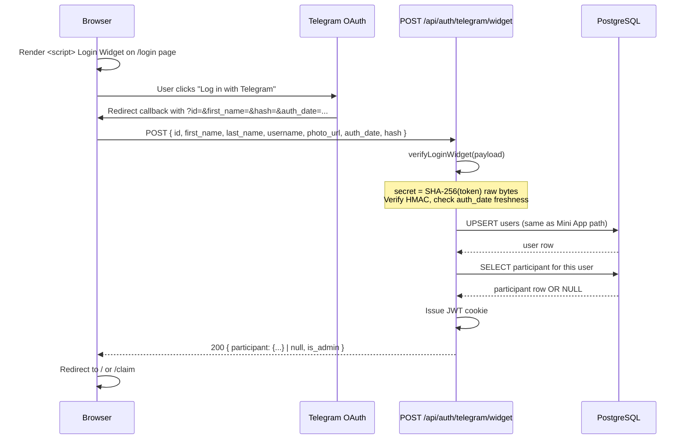
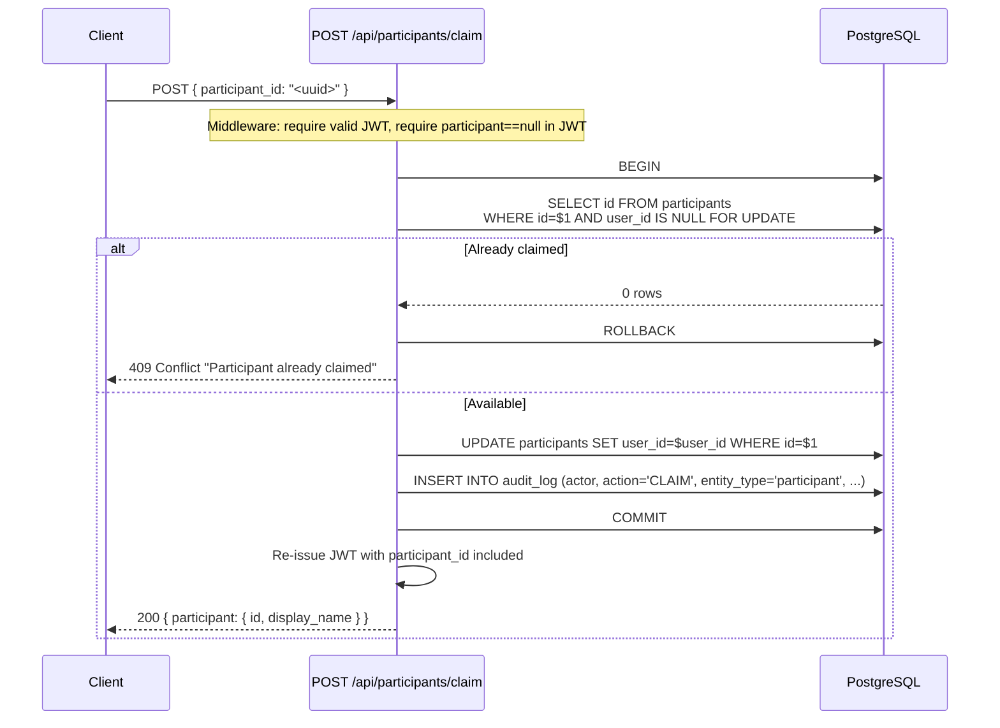

# 07 — Telegram Authentication

This document covers every detail of how users authenticate with Telegram, how their identity is
bound to one participant from the fixed 21-person roster, and how sessions are managed. It supersedes
the GPT draft on this topic — both HMAC verification schemes are reproduced exactly as Telegram
specifies them, because the secret-key derivation step differs between them in a way that is easy to
get wrong and hard to debug.

---

## 1. Decision: Mini App (primary) vs Login Widget (fallback)

| Dimension | Telegram Mini App (`initData`) | Login Widget |
|-----------|-------------------------------|--------------|
| **UX** | Seamless in-Telegram: user taps the bot's Menu Button or link — the web app opens inside Telegram with identity already present. No redirect, no external browser. | User sees a "Log in with Telegram" button on a web page, clicks it, Telegram opens to confirm, then redirects back. Two steps, requires leaving Telegram. |
| **Where it runs** | Inside Telegram's built-in WebView (iOS / Android / Desktop). Works on any device where the user has Telegram. | Any browser, including plain desktop. |
| **HTTPS / domain** | Only the HTTPS URL you register as the Mini App URL needs to be valid — Telegram's WebView handles the rest. | Requires BotFather `/setdomain` pointing at the exact origin. The widget JS will refuse to render on an unregistered origin. |
| **Setup** | `/newapp` in BotFather OR set Menu Button URL to `https://toto.icywhitephosphor.tech`. | `/setdomain toto.icywhitephosphor.tech` in BotFather. |
| **initData source** | Telegram injects `window.Telegram.WebApp.initData` automatically at launch. | Server receives the fields via query string or form POST after OAuth redirect. |
| **Verification** | HMAC-SHA256; secret derived with the literal string `"WebAppData"` as the HMAC key. | HMAC-SHA256; secret is the raw 32-byte SHA-256 of the bot token. **Different derivation.** |
| **Auth date freshness** | Check `auth_date` is not older than the replay window (recommended ≤ 24 h; use ≤ 1 h for stricter). | Same `auth_date` field; same check. |
| **Recommendation** | **Primary.** A friends' pool launched from the group bot is the ideal Mini App use case. | Fallback for users who prefer a plain browser tab. |

**Verdict:** implement Mini App as the default flow. Add the Login Widget for the edge case where
someone wants to open `https://toto.icywhitephosphor.tech` directly in a browser without Telegram.

---

## 2. BotFather setup

### 2.1 Bot creation

```
/newbot
  → choose name: TOTO WC-2026 (or any friendly name)
  → choose username: toto_wc2026_bot  (must end in _bot)
  → BotFather returns BOT_TOKEN e.g. 7123456789:AAFxyz...
```

### 2.2 Mini App (Web App)

```
/newapp
  → select your bot
  → enter title: TOTO WC-2026
  → enter description: Прогнозы на ЧМ-2026
  → upload icon (640×640 PNG/GIF)
  → enter URL: https://toto.icywhitephosphor.tech
```

Alternatively — just set the Menu Button so opening the bot opens the web app:

```
/mybots → select bot → Bot Settings → Menu Button
  → set URL: https://toto.icywhitephosphor.tech
```

### 2.3 Login Widget domain binding (for the fallback)

```
/mybots → select bot → Bot Settings → Domain
/setdomain
  → enter: toto.icywhitephosphor.tech
```

This must be the exact domain (no `www`, no trailing slash) or the widget will refuse to render.

### 2.4 Environment variables (server-only, never shipped to the client)

```
BOT_TOKEN=7123456789:AAFxyz...     # from BotFather — NEVER expose to the browser
BOT_USERNAME=toto_wc2026_bot       # for deep-link generation
JWT_SECRET=<64-byte random hex>    # openssl rand -hex 32
```

---

## 3. Verification algorithms

### 3.1 The critical difference between the two schemes

> **Common bug:** using SHA-256 of the bot token as the key for Mini App initData, or using the
> `"WebAppData"` HMAC derivation for the Login Widget. They are **not interchangeable**.

| Step | Mini App `initData` | Login Widget |
|------|---------------------|--------------|
| Secret key derivation | `HMAC_SHA256(key = "WebAppData", message = BOT_TOKEN)` | `SHA256(BOT_TOKEN)` as raw 32 bytes |
| Key type | 32-byte HMAC output | 32-byte hash digest |
| Node.js call | `createHmac('sha256', 'WebAppData').update(token).digest()` | `createHash('sha256').update(token).digest()` |

Both then compute `HMAC_SHA256(key = secret_key, message = data_check_string)` and compare the hex
result to the `hash` field using constant-time comparison.

### 3.2 TypeScript implementation

```typescript
// lib/telegram-auth.ts
import { createHash, createHmac, timingSafeEqual } from "node:crypto";

const BOT_TOKEN = process.env.BOT_TOKEN!;
const REPLAY_WINDOW_SECONDS = 60 * 60; // 1 hour; raise to 86400 if too strict for mobile users

// ---------------------------------------------------------------------------
// Mini App initData verification
//
// Telegram injects window.Telegram.WebApp.initData as a URL-encoded string.
// Example: "auth_date=1718000000&hash=abc123&query_id=AA...&user=%7B%22id%22%3A..."
//
// Algorithm:
//   1. Parse the string as URLSearchParams.
//   2. Remove the `hash` field; keep everything else.
//   3. Sort remaining fields alphabetically by key.
//   4. Build data_check_string: join as "key=value" lines separated by "\n".
//   5. secret_key = HMAC_SHA256(key="WebAppData", message=BOT_TOKEN)
//   6. expected_hash = hex( HMAC_SHA256(key=secret_key, message=data_check_string) )
//   7. Compare expected_hash to received hash using timingSafeEqual.
//   8. Reject if auth_date is older than REPLAY_WINDOW_SECONDS.
// ---------------------------------------------------------------------------
export interface TelegramUser {
  id: number;
  first_name: string;
  last_name?: string;
  username?: string;
  photo_url?: string;
  language_code?: string;
  is_premium?: boolean;
}

export interface VerifiedMiniAppIdentity {
  user: TelegramUser;
  auth_date: number;
  query_id?: string;
}

export function verifyMiniAppInitData(rawInitData: string): VerifiedMiniAppIdentity {
  const params = new URLSearchParams(rawInitData);

  const receivedHash = params.get("hash");
  if (!receivedHash) {
    throw new Error("initData missing hash field");
  }

  // Step 1: remove hash, collect the rest
  params.delete("hash");

  // Step 2: sort alphabetically by key, build data_check_string
  const sortedEntries = [...params.entries()].sort(([a], [b]) => a.localeCompare(b));
  const dataCheckString = sortedEntries.map(([k, v]) => `${k}=${v}`).join("\n");

  // Step 3: derive secret key — NOTE: key is the literal string "WebAppData"
  const secretKey = createHmac("sha256", "WebAppData").update(BOT_TOKEN).digest();

  // Step 4: compute expected hash
  const expectedHash = createHmac("sha256", secretKey).update(dataCheckString).digest("hex");

  // Step 5: constant-time compare (prevents timing attacks)
  const expectedBuf = Buffer.from(expectedHash, "utf8");
  const receivedBuf = Buffer.from(receivedHash.toLowerCase(), "utf8");
  if (expectedBuf.length !== receivedBuf.length || !timingSafeEqual(expectedBuf, receivedBuf)) {
    throw new Error("initData signature invalid");
  }

  // Step 6: replay check
  const authDate = Number(params.get("auth_date"));
  if (!authDate || Date.now() / 1000 - authDate > REPLAY_WINDOW_SECONDS) {
    throw new Error("initData auth_date too old (replay rejected)");
  }

  // Step 7: parse user JSON field
  const userJson = params.get("user");
  if (!userJson) {
    throw new Error("initData missing user field");
  }
  const user: TelegramUser = JSON.parse(userJson);

  return { user, auth_date: authDate, query_id: params.get("query_id") ?? undefined };
}

// ---------------------------------------------------------------------------
// Login Widget verification
//
// BotFather sends fields: id, first_name, last_name, username, photo_url,
// auth_date, hash — via query string or POST body.
//
// Algorithm:
//   1. Collect all fields EXCEPT hash.
//   2. Sort alphabetically by key.
//   3. data_check_string = "key=value\n..." joined by "\n".
//   4. secret_key = SHA256(BOT_TOKEN) as raw 32 bytes  ← NOT an HMAC, a plain hash
//   5. expected_hash = hex( HMAC_SHA256(key=secret_key, message=data_check_string) )
//   6. Compare with timingSafeEqual; check auth_date freshness.
// ---------------------------------------------------------------------------
export interface LoginWidgetPayload {
  id: string;
  first_name: string;
  last_name?: string;
  username?: string;
  photo_url?: string;
  auth_date: string;
  hash: string;
}

export interface VerifiedWidgetIdentity {
  id: number;
  first_name: string;
  last_name?: string;
  username?: string;
  photo_url?: string;
  auth_date: number;
}

export function verifyLoginWidget(payload: LoginWidgetPayload): VerifiedWidgetIdentity {
  const { hash: receivedHash, ...rest } = payload;

  // Step 1: sort remaining fields alphabetically
  const dataCheckString = Object.entries(rest)
    .filter(([, v]) => v !== undefined && v !== null && v !== "")
    .sort(([a], [b]) => a.localeCompare(b))
    .map(([k, v]) => `${k}=${v}`)
    .join("\n");

  // Step 2: derive secret key — NOTE: plain SHA-256 hash, NOT an HMAC
  const secretKey = createHash("sha256").update(BOT_TOKEN).digest(); // raw Buffer, 32 bytes

  // Step 3: compute expected hash
  const expectedHash = createHmac("sha256", secretKey).update(dataCheckString).digest("hex");

  // Step 4: constant-time compare
  const expectedBuf = Buffer.from(expectedHash, "utf8");
  const receivedBuf = Buffer.from(receivedHash.toLowerCase(), "utf8");
  if (expectedBuf.length !== receivedBuf.length || !timingSafeEqual(expectedBuf, receivedBuf)) {
    throw new Error("Login Widget signature invalid");
  }

  // Step 5: replay check
  const authDate = Number(rest.auth_date);
  if (!authDate || Date.now() / 1000 - authDate > REPLAY_WINDOW_SECONDS) {
    throw new Error("Login Widget auth_date too old (replay rejected)");
  }

  return {
    id: Number(rest.id),
    first_name: rest.first_name,
    last_name: rest.last_name,
    username: rest.username,
    photo_url: rest.photo_url,
    auth_date: authDate,
  };
}
```

---

## 4. Sequence diagrams

### 4.a Mini App launch

```mermaid
sequenceDiagram
    participant T as Telegram Client
    participant W as WebView (Next.js)
    participant S as POST /api/auth/telegram/miniapp
    participant DB as PostgreSQL

    T->>W: User taps Menu Button / bot link
    Note over W: Telegram injects window.Telegram.WebApp.initData
    W->>W: Read initData from Telegram.WebApp.initData
    W->>S: POST { initData: "<raw string>" }
    S->>S: verifyMiniAppInitData(initData)
    Note over S: Derive secret via HMAC("WebAppData", token)<br/>Verify hash, check auth_date freshness
    S->>DB: UPSERT users SET username, first_name, last_login_at<br/>WHERE telegram_id = user.id
    DB-->>S: user row (id, is_admin, ...)
    S->>DB: SELECT id, display_name FROM participants<br/>WHERE user_id = users.id
    DB-->>S: participant row OR NULL
    S->>S: Issue JWT; set httpOnly+Secure+SameSite=Lax cookie
    S-->>W: 200 { participant: {...} | null, is_admin, unclaimed_count }
    W->>W: participant == null → show claim screen<br/>else → show bet screen
```

### 4.b Login Widget fallback



---

## 5. Participant claim and admin rebind

### 5.1 First-login state

After authentication, the server returns `participant: null` when the `users` row has no
corresponding `participants.user_id`. The client shows a list of unclaimed roster names (in Russian).

```
GET /api/participants
→ 200 [ { id, display_name, claimed: false }, ... ]   // only unclaimed rows shown to a new user
```

### 5.2 Claim flow



Key invariants enforced by the DB:
- `participants.user_id UNIQUE` — two users cannot claim the same name, even under a race condition
  (the `FOR UPDATE` row lock plus the unique constraint provide two layers of protection).
- `users.telegram_id UNIQUE` — one Telegram account cannot create two `users` rows.

### 5.3 Admin rebind

For mistakes (wrong claim, Telegram account change):

```
POST /api/admin/participants/:id/rebind
Body: { new_user_id: "<uuid>" | null }
```

Requires `users.is_admin = true` in the JWT. The handler:
1. Verifies the requesting user `is_admin`.
2. In a transaction: clears `participants.user_id` for the given participant, then sets it to
   `new_user_id` (or leaves it NULL to free the slot).
3. If `new_user_id` already has a different participant claimed, rejects with 409.
4. Writes before/after state to `audit_log`.
5. Does **not** invalidate existing JWTs — the rebound user's next request will re-read from DB
   (see §6 on `participant_id` in JWT being advisory).

---

## 6. Session management

### 6.1 JWT payload

```typescript
interface JwtPayload {
  sub: string;          // users.id (uuid)
  tg: number;           // users.telegram_id (bigint)
  pid?: string;         // participants.id (uuid) — absent until claimed
  adm?: true;           // present and true if users.is_admin
  iat: number;          // issued at (Unix seconds)
  exp: number;          // expiry (Unix seconds)
}
```

`pid` and `adm` are cached in the token for performance. On any write operation (bet placement,
admin action) the server re-reads `users` and `participants` from the DB to verify current state,
so a rebind or admin-flag change takes effect on the next write at the latest.

### 6.2 Cookie flags

```
Set-Cookie: session=<jwt>; HttpOnly; Secure; SameSite=Lax; Path=/; Max-Age=2592000
```

- `HttpOnly` — JavaScript cannot read the cookie; prevents XSS token theft.
- `Secure` — transmitted only over HTTPS. This is why Caddy + Let's Encrypt is mandatory.
- `SameSite=Lax` — blocks cross-site POST forgery while allowing top-level navigations (needed
  for the Login Widget redirect callback).
- `Max-Age=2592000` — 30-day cookie; JWT `exp` is independently enforced server-side.

### 6.3 Token lifetime and refresh

- JWT `exp` = 30 days from issue.
- On any authenticated request, if the token is within 7 days of expiry, the server re-issues
  a fresh token (same payload, new `iat`/`exp`) in the response `Set-Cookie`. No explicit
  refresh endpoint is needed at this scale.

### 6.4 Logout

```
POST /api/auth/logout
→ Set-Cookie: session=; HttpOnly; Secure; SameSite=Lax; Path=/; Max-Age=0
→ 200 {}
```

No server session table is required for Track A. If you later need instant revocation (e.g. to
force a rebound user offline immediately), add the optional `sessions` table from `04` §7 and
check it in the auth middleware.

---

## 7. Threat model

| Threat | Mitigation |
|--------|-----------|
| **Forged `initData`** | HMAC verified server-side using `BOT_TOKEN` which never leaves the server. Without the bot token an attacker cannot construct a valid `hash`. |
| **Forged Login Widget payload** | Same HMAC check with the SHA-256-derived secret. |
| **Replay attack** | `auth_date` freshness check (≤ 1 h by default). An intercepted `initData` or widget payload becomes invalid after the window. |
| **Impersonation / roster stuffing** | `participants` is a pre-seeded allow-list of exactly 21 names. A valid Telegram login for an account not on the list gets a `users` row but can never claim a participant; they see no bet UI. Enforced by `participants.user_id UNIQUE` and the claim logic. |
| **One person, multiple accounts** | `users.telegram_id UNIQUE` prevents a single Telegram ID from creating multiple accounts. `participants.user_id UNIQUE` ensures each roster slot is bound to at most one user. Admin rebind is the only path to change a binding, and it is audit-logged. |
| **BOT_TOKEN leakage** | Token is in server-only env (`process.env.BOT_TOKEN`). It is never written to `process.env.NEXT_PUBLIC_*`, never returned in any API response, never logged. The Next.js build system strips server-only env from the client bundle. |
| **HTTPS requirement** | Caddy auto-provisions Let's Encrypt TLS for `toto.icywhitephosphor.tech`. Telegram's Mini App WebView refuses to load non-HTTPS URLs; the Login Widget refuses to display on non-HTTPS origins. Both mechanisms enforce HTTPS independently of our own cookie `Secure` flag. |
| **Domain binding** | BotFather `/setdomain` restricts the Login Widget to `toto.icywhitephosphor.tech`. An attacker cannot embed the widget on a phishing page and receive valid callbacks. |
| **XSS / cookie theft** | `HttpOnly` cookie prevents JavaScript access. CSP headers (set in `next.config.ts`) limit script sources. |
| **CSRF** | `SameSite=Lax` covers the vast majority of CSRF vectors. All state-mutating endpoints are POST/PUT/DELETE (not GET), so Lax is sufficient. Add a CSRF token header check if you want belt-and-suspenders. |
| **Timing attacks on hash comparison** | Both verify functions use `crypto.timingSafeEqual` to compare the expected and received hash strings as fixed-length Buffers. |

---

## 8. Notification bot (same BOT_TOKEN)

The same `BOT_TOKEN` can be used to send DM reminders via the Telegram Bot API — no second bot is
needed. The worker process (see `02` §6) can call:

```
POST https://api.telegram.org/bot{BOT_TOKEN}/sendMessage
{ "chat_id": <users.telegram_id>, "text": "..." }
```

Use cases:
- Reminder 24 h before bonus deadline (`2026-06-09 20:00 UTC`).
- Reminder when a match bet deadline is approaching (e.g. 2 h before kickoff).
- Notification when match results are confirmed (score posted to the group chat or per-user DM).

The `users.telegram_id` column stores exactly the value needed as `chat_id`. Note: the bot can only
DM a user who has previously started a conversation with it (`/start`). Include a prompt in the
onboarding flow asking users to do this.
