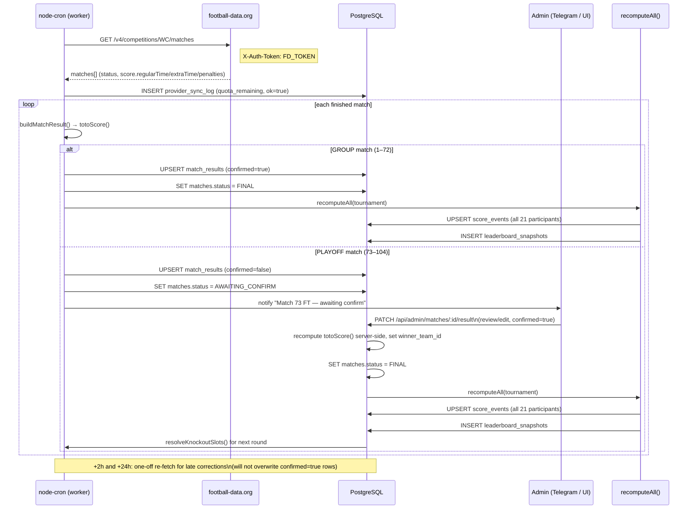

# 08 — Live Results Integration

This document specifies how the toto worker process pulls live match results from
football-data.org, maps them to the canonical data model (`04`), calls `totoScore()` (`05`), and
feeds confirmed results to the scoring engine. Deployment: VPS 72.56.232.82, always-on Node.js
worker using `node-cron`. Domain: toto.icywhitephosphor.tech.

---

## 1. Provider Comparison

| Criterion | **football-data.org** (v4) | API-Football v3 | TheSportsDB | openfootball/worldcup.json |
|-----------|---------------------------|-----------------|-------------|---------------------------|
| Free quota | 10 req/min | 100 req/day (resets 00:00 UTC) | Public; live = paid V2 | No key; static file |
| Live latency (free) | ~1–3 min delayed | Near real-time (free, but quota kills it) | N/A (paid only) | N/A (community pushes) |
| ET + penalty fields | Yes — `regularTime`, `extraTime`, `penalties`, `winner`, `duration` in `score` object | Yes — `score.halftime/fulltime/extratime/penalty` | Yes (historical) | Partial |
| WC 2026 coverage | `WC` / competition id `2000` | league=1, season=2026 | Yes | Community-maintained |
| Auth | Header `X-Auth-Token: <FD_TOKEN>` | Header `x-apisports-key: <key>` | Public key `123` | None |
| Verdict | **PRIMARY** — sufficient free quota for our 104-match pool; ET/penalty breakdown available on free tier; `fifa_match_no` alignment via stable per-competition fixture ordering | Paid/real-time upgrade; 100 req/day far too tight for match-day polling | Logos and team artwork only; NOT for live data on free | Offline seed and fallback fixture list only |

**Recommendation:**
- **Primary:** football-data.org, free tier, all 104 matches.
- **Play-off confirmation:** mandatory admin confirm for all matches 73–104 (R32…FINAL) before
  scoring runs. High stakes, ×2 multiplier, penalty canonical score.
- **Paid upgrade path:** API-Football as a drop-in via the `FootballProvider` interface (§2) once
  quota becomes a concern (e.g. simultaneous group-stage matches in the final group-stage round).
- **Logos:** TheSportsDB (key `123`) for `teams.logo_url` during seed — one-off, not polling.
- **Backup seed:** openfootball `worldcup.json` for initial fixture list and cross-checking
  `kickoff_at` / venue before the tournament starts.

---

## 2. Provider Abstraction

The `FootballProvider` interface keeps the worker decoupled from the data source.
A second implementation is a Track B option; only `FootballDataOrgProvider` ships now.

```ts
// packages/provider/src/types.ts

export interface ProviderFixture {
  providerMatchId: string;
  fifaMatchNo:     number;           // matched to matches.fifa_match_no
  homeTeamProviderId: string;
  awayTeamProviderId: string;
  kickoffAt:       Date | null;
  venue:           string | null;
  city:            string | null;
  status:          ProviderStatus;
  score: {
    winner:      'HOME_TEAM' | 'AWAY_TEAM' | 'DRAW' | null;
    duration:    'REGULAR' | 'EXTRA_TIME' | 'PENALTY_SHOOTOUT' | null;
    fullTime:    { home: number | null; away: number | null };
    regularTime: { home: number | null; away: number | null };
    extraTime:   { home: number | null; away: number | null };
    penalties:   { home: number | null; away: number | null };
  };
}

export type ProviderStatus =
  | 'SCHEDULED' | 'TIMED' | 'IN_PLAY' | 'PAUSED'
  | 'FINISHED' | 'SUSPENDED' | 'POSTPONED' | 'CANCELLED';

export interface ProviderStanding {
  groupCode:       string;
  position:        number;
  teamProviderId:  string;
  points:          number;
  goalsFor:        number;
  goalsAgainst:    number;
  goalDifference:  number;
  won:             number;
  draw:            number;
  lost:            number;
}

export interface ProviderTopScorer {
  playerName:     string;
  teamProviderId: string;
  goals:          number;
}

export interface FootballProvider {
  /** All 104 WC fixtures with current scores. One call = all matches. */
  getFixtures(): Promise<ProviderFixture[]>;

  /** Single match by provider id. Use only for targeted re-fetches. */
  getMatch(providerMatchId: string): Promise<ProviderFixture>;

  /** Group standings for bracket resolution. */
  getStandings(): Promise<ProviderStanding[]>;

  /** Golden Boot leaderboard. */
  getTopScorers(): Promise<ProviderTopScorer[]>;
}
```

```ts
// packages/provider/src/FootballDataOrgProvider.ts

import fetch from 'node-fetch';
import type { FootballProvider, ProviderFixture, ProviderStanding, ProviderTopScorer } from './types';

const BASE = 'https://api.football-data.org/v4';
const COMPETITION = 'WC';   // id 2000

export class FootballDataOrgProvider implements FootballProvider {
  constructor(private readonly token: string) {}

  private headers() {
    return { 'X-Auth-Token': this.token };
  }

  async getFixtures(): Promise<ProviderFixture[]> {
    const res = await fetch(`${BASE}/competitions/${COMPETITION}/matches`, {
      headers: this.headers(),
    });
    if (!res.ok) throw new Error(`FD fixtures ${res.status}`);
    const data = await res.json() as any;
    return (data.matches as any[]).map(mapFixture);
  }

  async getMatch(providerMatchId: string): Promise<ProviderFixture> {
    const res = await fetch(`${BASE}/matches/${providerMatchId}`, {
      headers: this.headers(),
    });
    if (!res.ok) throw new Error(`FD match ${providerMatchId}: ${res.status}`);
    const data = await res.json() as any;
    return mapFixture(data.match ?? data);
  }

  async getStandings(): Promise<ProviderStanding[]> {
    const res = await fetch(`${BASE}/competitions/${COMPETITION}/standings`, {
      headers: this.headers(),
    });
    if (!res.ok) throw new Error(`FD standings ${res.status}`);
    const data = await res.json() as any;
    return mapStandings(data.standings);
  }

  async getTopScorers(): Promise<ProviderTopScorer[]> {
    const res = await fetch(`${BASE}/competitions/${COMPETITION}/scorers`, {
      headers: this.headers(),
    });
    if (!res.ok) throw new Error(`FD scorers ${res.status}`);
    const data = await res.json() as any;
    return (data.scorers as any[]).map(s => ({
      playerName:     s.player.name,
      teamProviderId: String(s.team.id),
      goals:          s.goals,
    }));
  }
}

function mapFixture(m: any): ProviderFixture {
  return {
    providerMatchId:    String(m.id),
    fifaMatchNo:        m.matchday ?? 0,   // see §4 note on mapping
    homeTeamProviderId: String(m.homeTeam?.id),
    awayTeamProviderId: String(m.awayTeam?.id),
    kickoffAt:          m.utcDate ? new Date(m.utcDate) : null,
    venue:              m.venue ?? null,
    city:               m.area?.name ?? null,
    status:             m.status,
    score: {
      winner:      m.score?.winner ?? null,
      duration:    m.score?.duration ?? null,
      fullTime:    m.score?.fullTime    ?? { home: null, away: null },
      regularTime: m.score?.regularTime ?? { home: null, away: null },
      extraTime:   m.score?.extraTime   ?? { home: null, away: null },
      penalties:   m.score?.penalties   ?? { home: null, away: null },
    },
  };
}

function mapStandings(standings: any[]): ProviderStanding[] {
  const rows: ProviderStanding[] = [];
  for (const group of standings) {
    const code = group.group?.replace('GROUP_', '') ?? '';
    for (const t of group.table ?? []) {
      rows.push({
        groupCode:       code,
        position:        t.position,
        teamProviderId:  String(t.team.id),
        points:          t.points,
        goalsFor:        t.goalsFor,
        goalsAgainst:    t.goalsAgainst,
        goalDifference:  t.goalDifference,
        won:             t.won,
        draw:            t.draw,
        lost:            t.lost,
      });
    }
  }
  return rows;
}
```

---

## 3. Exact API Calls — football-data.org

### 3.1 All WC fixtures and results

```bash
curl -s \
  -H "X-Auth-Token: $FD_TOKEN" \
  "https://api.football-data.org/v4/competitions/WC/matches" \
  | jq '.matches[0]'
```

Trimmed response (single match object, group stage example):

```json
{
  "id": 419718,
  "utcDate": "2026-06-11T18:00:00Z",
  "status": "FINISHED",
  "matchday": 1,
  "stage": "GROUP_STAGE",
  "group": "GROUP_A",
  "homeTeam": { "id": 773, "name": "Mexico", "shortName": "Mexico", "tla": "MEX" },
  "awayTeam": { "id": 815, "name": "South Africa", "shortName": "S. Africa", "tla": "RSA" },
  "score": {
    "winner": "HOME_TEAM",
    "duration": "REGULAR",
    "fullTime":    { "home": 2, "away": 0 },
    "halfTime":    { "home": 1, "away": 0 },
    "regularTime": { "home": 2, "away": 0 },
    "extraTime":   { "home": null, "away": null },
    "penalties":   { "home": null, "away": null }
  },
  "venue": "AT&T Stadium",
  "area": { "name": "World" }
}
```

Play-off example (ET + penalties):

```json
{
  "id": 419791,
  "status": "FINISHED",
  "stage": "ROUND_OF_32",
  "score": {
    "winner": "AWAY_TEAM",
    "duration": "PENALTY_SHOOTOUT",
    "fullTime":    { "home": 2, "away": 2 },
    "regularTime": { "home": 1, "away": 1 },
    "extraTime":   { "home": 2, "away": 2 },
    "penalties":   { "home": 3, "away": 5 }
  }
}
```

Response headers include quota:

```
X-Requests-Available-Minute: 8
X-RequestCounter-Reset: 60
```

### 3.2 Group standings

```bash
curl -s \
  -H "X-Auth-Token: $FD_TOKEN" \
  "https://api.football-data.org/v4/competitions/WC/standings" \
  | jq '.standings[0].table[0]'
```

```json
{
  "position": 1,
  "team": { "id": 773, "name": "Mexico", "tla": "MEX" },
  "playedGames": 3,
  "won": 2,
  "draw": 1,
  "lost": 0,
  "points": 7,
  "goalsFor": 5,
  "goalsAgainst": 2,
  "goalDifference": 3
}
```

### 3.3 Top scorers

```bash
curl -s \
  -H "X-Auth-Token: $FD_TOKEN" \
  "https://api.football-data.org/v4/competitions/WC/scorers" \
  | jq '.scorers[0]'
```

```json
{
  "player": { "id": 44, "name": "Erling Haaland", "nationality": "Norway" },
  "team":   { "id": 1044, "name": "Norway" },
  "goals": 7
}
```

---

## 4. Provider → Domain Mapping

### 4.1 Fixture → match row

The worker resolves a provider fixture to a `matches` row in two steps:

1. **By `provider_match_id`** (if already stored): fastest path; exact.
2. **By `fifa_match_no`**: football-data.org numbers group matches by matchday (1–6 per group) but
   also exposes a competition-scoped sequential match id. During the initial fixture import the
   worker assigns `fifa_match_no` by sorting all 104 fixtures by `stage` (GROUP → R32 → …) then by
   scheduled `utcDate`, yielding the 1–104 sequence that matches the spreadsheet. Once stored in
   `matches.provider_match_id` all subsequent polls use path 1.

### 4.2 Status mapping

| football-data.org status | `matches.status` | `match_results.result_status` |
|--------------------------|-----------------|-------------------------------|
| `SCHEDULED` / `TIMED`   | `SCHEDULED`     | `SCHEDULED`                   |
| `IN_PLAY`               | `LIVE`          | `LIVE`                        |
| `PAUSED`                | `LIVE`          | `LIVE`                        |
| `FINISHED` (GROUP)      | `FINAL`         | `FT` / `AET`                  |
| `FINISHED` (playoff)    | `AWAITING_CONFIRM` | `FT` / `AET` / `PEN`       |
| `SUSPENDED`             | `LIVE`          | `LIVE`                        |
| `POSTPONED`             | `SCHEDULED`     | `SCHEDULED`                   |
| `CANCELLED`             | `CANCELLED`     | `CANCELLED`                   |

> Play-off matches (fifa_match_no 73–104) always land in `AWAITING_CONFIRM` upon provider
> `FINISHED`; they never go directly to `FINAL`. See §7.

### 4.3 Building match_results from the score object

```ts
import { totoScore } from '@toto/scoring';

function buildMatchResult(f: ProviderFixture, matchId: string, isPlayoff: boolean) {
  const s = f.score;

  // base = regulation score; if ET played, base = regularTime + extraTime cumulative (= fullTime)
  let baseHome: number | null = null;
  let baseAway: number | null = null;

  if (s.duration === 'REGULAR') {
    baseHome = s.fullTime.home;
    baseAway = s.fullTime.away;
  } else if (s.duration === 'EXTRA_TIME') {
    // fullTime here is the end-of-ET score
    baseHome = s.fullTime.home;
    baseAway = s.fullTime.away;
  } else if (s.duration === 'PENALTY_SHOOTOUT') {
    // base = score after ET (= fullTime on provider); pens separate
    baseHome = s.fullTime.home;
    baseAway = s.fullTime.away;
  }

  const penHome = s.penalties.home ?? null;
  const penAway = s.penalties.away ?? null;

  let toto = { home: baseHome ?? 0, away: baseAway ?? 0 };
  if (baseHome !== null && baseAway !== null) {
    toto = totoScore({ baseHome, baseAway, penHome, penAway });
  }

  const resultStatus =
    s.duration === 'PENALTY_SHOOTOUT' ? 'PEN'
    : s.duration === 'EXTRA_TIME'     ? 'AET'
    : s.duration === 'REGULAR'        ? 'FT'
    : 'LIVE';

  const winnerTeamId: string | null = null; // resolved in §4.4

  return {
    matchId,
    resultStatus,
    baseHome,
    baseAway,
    penHome,
    penAway,
    toToHome: toto.home,
    toToAway: toto.away,
    winnerTeamId,
    source: 'PROVIDER' as const,
    confirmed: isPlayoff ? false : true,   // group matches auto-confirm
    providerPayload: f as unknown as Record<string, unknown>,
  };
}
```

### 4.4 Setting winner_team_id

After computing `toto_home` / `toto_away`:

```ts
function resolveWinner(
  totoHome: number,
  totoAway: number,
  homeTeamId: string,
  awayTeamId: string,
): string | null {
  if (totoHome > totoAway) return homeTeamId;
  if (totoAway > totoHome) return awayTeamId;
  return null;   // genuine draw — group matches only
}
```

For group matches a `null` winner is valid (draw). For playoff matches the `totoScore` function
guarantees the result is never a draw (penalty +1 rule), so `winner_team_id` is always populated.

---

## 5. Bracket Resolution from Provider

When a round completes the provider publishes resolved knockout fixtures with real team ids. The
worker detects this and fills `matches.home_team_id` / `matches.away_team_id` for upcoming rounds.

```ts
async function resolveKnockoutSlots(provider: FootballProvider, db: Db) {
  const fixtures = await provider.getFixtures();
  for (const f of fixtures) {
    if (!f.homeTeamProviderId || !f.awayTeamProviderId) continue;
    const match = await db.query(
      `SELECT id, home_team_id, away_team_id, status
         FROM matches WHERE provider_match_id = $1`,
      [f.providerMatchId],
    );
    if (!match) continue;
    if (match.home_team_id && match.away_team_id) continue; // already resolved

    const homeTeam = await db.queryOne(
      `SELECT id FROM teams WHERE provider_team_id = $1`, [f.homeTeamProviderId]);
    const awayTeam = await db.queryOne(
      `SELECT id FROM teams WHERE provider_team_id = $1`, [f.awayTeamProviderId]);

    if (homeTeam && awayTeam) {
      await db.query(
        `UPDATE matches
            SET home_team_id = $1, away_team_id = $2, updated_at = now()
          WHERE id = $3`,
        [homeTeam.id, awayTeam.id, match.id],
      );
      // Admin notification queued; admin confirms via PATCH /api/admin/matches/:id/result (06)
      await enqueueAdminReview(match.id, 'bracket_slot_resolved');
    }
  }
}
```

This is called once after each round's last result is confirmed. For the 8 third-placed slots (§5
of `03`) the provider resolves them automatically; the app does not need the 495-row Annex C matrix
unless the provider lags.

---

## 6. Polling Schedule

The worker (`apps/worker/src/poller.ts`) runs three cron jobs. All calls are logged to
`provider_sync_log` with quota remaining from `X-Requests-Available-Minute`.

### Quota budget

- 10 req/min on free tier.
- On any given day with simultaneous matches: **one** call to `/competitions/WC/matches` returns
  all 104 matches. No per-match polling needed during normal operation.
- Reserve 3 req/min headroom for admin-triggered re-fetches and bracket-resolution calls.

### Cron jobs

```ts
import cron from 'node-cron';

// Job 1: Fixtures sync — every 6 hours pre-tournament and outside match windows.
// Updates kickoff_at, venue, provider_match_id for all 104 matches.
cron.schedule('0 */6 * * *', () => {
  if (!isMatchDayWindow()) syncFixtures();
});

// Job 2: Live poll — every 60 s during an active match window.
// A "match window" = any day with at least one match; within [earliest_kickoff - 30min,
// latest_expected_finish + 90min]. Up to 4 group matches/day = still one API call/poll.
cron.schedule('* * * * *', async () => {
  if (!isMatchDayWindow()) return;
  await pollAndUpsertResults();
});

// Job 3: Post-FT verification — at +2h and +24h after each match window closes.
// Providers occasionally correct penalties/scorers retroactively.
cron.schedule('*/5 * * * *', async () => {
  await verifyRecentlyFinished();  // only re-fetches matches FT'd < 24h ago, not yet confirmed
});
```

**Backoff during a live window:**

| Phase | Poll interval | Rationale |
|-------|--------------|-----------|
| Pre-kickoff (< 30 min) | 5 min | Status unlikely to change |
| IN_PLAY / PAUSED | 60 s | 1 req/min well within 10 req/min limit |
| Just FT (≤ 30 min post) | 2 min | Await official confirmation of score |
| +30 min to +2 h | 10 min | Catch late corrections |
| +2 h verification | one-off fetch | Final canonical check |
| +24 h verification | one-off fetch | Rare retroactive corrections |

### provider_sync_log write

```ts
async function logSync(params: {
  provider: string;
  endpoint: string;
  requestParams: object;
  httpStatus: number;
  items: number;
  ok: boolean;
  error?: string;
  quotaRemaining?: number;
  startedAt: Date;
}) {
  await db.query(
    `INSERT INTO provider_sync_log
       (provider, endpoint, request_params, http_status, items, ok, error, quota_remaining, started_at, finished_at)
     VALUES ($1,$2,$3,$4,$5,$6,$7,$8,$9,now())`,
    [params.provider, params.endpoint, params.requestParams, params.httpStatus,
     params.items, params.ok, params.error ?? null, params.quotaRemaining ?? null, params.startedAt],
  );
}
```

---

## 7. AWAITING_CONFIRM Flow for Play-off Matches

Play-off results (matches 73–104) require explicit admin confirmation before the scoring engine
uses them. This prevents a premature recompute on a provisional or mis-reported result.

**State machine for a play-off match:**

```
SCHEDULED → LIVE → AWAITING_CONFIRM → FINAL
                              ↑
                     admin PATCH /api/admin/matches/:id/result
                     (sets confirmed=true, optionally edits canonical score)
                     → triggers recomputeAll()
```

Steps:

1. Provider returns `FINISHED` for a play-off match.
2. Worker writes/upserts `match_results` with `confirmed = false`, sets `matches.status =
   'AWAITING_CONFIRM'`.
3. Admin is notified (Telegram bot message or in-app flag).
4. Admin reviews the result — verifies `base_home`/`base_away`, `pen_home`/`pen_away` — and
   optionally corrects.
5. Admin calls `PATCH /api/admin/matches/:id/result` (`06` §PATCH) with `confirmed: true`.
   The API recomputes `toto_home`/`toto_away` via `totoScore()`, sets `winner_team_id`, sets
   `matches.status = 'FINAL'`, sets `source = 'ADMIN'` if edited.
6. `recomputeAll()` fires (`05` §7): score_events upserted for all 21 participants, leaderboard
   snapshot written.
7. Bracket slot resolution runs for the next round (§5).

Group matches (1–72) skip this flow: upon provider `FINISHED` the worker sets `confirmed = true`
immediately and queues a recompute.

---

## 8. Idempotent Upserts, Reconciliation & Failure Handling

### Idempotent result upsert

```sql
INSERT INTO match_results
  (match_id, result_status, base_home, base_away, pen_home, pen_away,
   toto_home, toto_away, winner_team_id, source, confirmed, provider_payload, updated_at)
VALUES ($1,$2,$3,$4,$5,$6,$7,$8,$9,$10,$11,$12,now())
ON CONFLICT (match_id) DO UPDATE SET
  result_status    = EXCLUDED.result_status,
  base_home        = EXCLUDED.base_home,
  base_away        = EXCLUDED.base_away,
  pen_home         = EXCLUDED.pen_home,
  pen_away         = EXCLUDED.pen_away,
  toto_home        = EXCLUDED.toto_home,
  toto_away        = EXCLUDED.toto_away,
  winner_team_id   = EXCLUDED.winner_team_id,
  provider_payload = EXCLUDED.provider_payload,
  updated_at       = now()
WHERE match_results.confirmed = false;   -- never overwrite a confirmed result
```

The `WHERE confirmed = false` guard ensures a confirmed (possibly admin-edited) result is never
silently overwritten by a later provider poll.

### Late corrections

If a provider retroactively corrects a result that is already confirmed (e.g. a goal disallowed by
VAR hours later), the worker detects a difference between the stored `provider_payload` and the new
payload and queues an `ADMIN_REVIEW` audit entry. An admin must explicitly re-confirm via the PATCH
endpoint; the guard above prevents silent overwrites.

### Failure modes

| Failure | Behaviour |
|---------|-----------|
| HTTP 5xx from provider | Retry with exponential backoff (3×); log to `provider_sync_log` with `ok=false` |
| HTTP 429 (rate limit) | Back off 60 s; reduce polling frequency for the remainder of the minute |
| Provider returns malformed JSON | Catch, log, skip upsert; do not crash worker |
| Provider not responding for > 10 min | Telegram alert to admin; switch to manual entry |
| `confirmed=true` row in DB vs different provider payload | Log discrepancy to `audit_log`; queue admin review; do not auto-update |
| Worker crash/restart | Cron picks up at next tick; idempotent upserts make this safe |

### Manual fallback

If the provider is unavailable the admin can enter results directly via
`PATCH /api/admin/matches/:id/result` with `source: 'ADMIN'`. This sets `confirmed = true`
immediately and triggers a recompute. The audit_log records `before`/`after` for every manual entry.

### Environment

```
# .env
FD_TOKEN=<football-data.org API token>
DATABASE_URL=postgres://toto:…@localhost:5432/toto
```

The worker reads `process.env.FD_TOKEN` at startup and passes it to `FootballDataOrgProvider`.
Never commit the token; inject via systemd `EnvironmentFile` on the VPS.

---

## 9. Sequence Diagram



---

## 10. Cross-references

| Topic | Document |
|-------|----------|
| `totoScore()` canonical score | `05` §2 |
| `match_results` schema (columns used above) | `04` §4 |
| Bracket slot placeholders (home_slot/away_slot) | `03` §4 |
| Admin PATCH endpoint | `06` §PATCH /api/admin/matches/:id/result |
| `recomputeAll()` orchestrator | `05` §7 |
| Bonus settlement triggers (group winners, R16_PARTICIPANT…) | `05` §4 |
| Fixture deadlines derived from kickoff_at | `11` |
