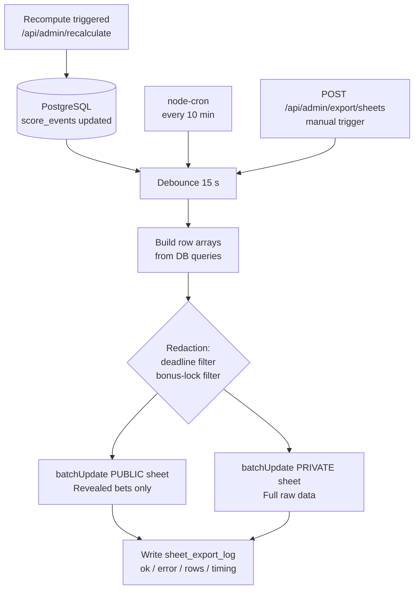

# 09 — Google Sheets Export

PostgreSQL is the **source of truth**. Google Sheets is a **read-only mirror** for transparency.
The export is unidirectional: DB → Sheets. Nothing is ever written back from Sheets to the DB.

---

## 1. Two-spreadsheet model

Two separate spreadsheets are maintained, both written by the same service account.

| Spreadsheet | Who can open it | What it contains |
|---|---|---|
| **PRIVATE** | Organizer (admin) only | Full raw data — all bets, all bonus bets, audit log, export log, participants roster |
| **PUBLIC** | All 21 friends | Only **revealed** data — bets whose deadline has already passed, confirmed results, leaderboard, prizes |

### Why two spreadsheets, not one with hidden tabs?

A single shared spreadsheet with hidden or protected sheets is **not safe**. Google Sheets does not
enforce server-side column/row visibility in a secrets sense: a person with the share link can export
to CSV, use the Sheets API directly with their own token, or inspect the underlying JSON feed at
`https://spreadsheets.google.com/feeds/...`. Hidden sheets are trivially revealed by a tech-savvy
friend. If you put un-revealed bets in a shared spreadsheet, the fairness guarantee of FR-24 is broken.

The only safe model is a **separate file** for each access level. The public spreadsheet never receives
a bet row until `now() >= matches.deadline_at` (for match bets) or until the global bonus lock at
2026-06-10 23:00 MSK (for bonus bets). This redaction is done in the export code, **not** via Sheets
permissions.

---

## 2. Service account setup

### 2.1 GCP project & API

1. Create (or reuse) a GCP project — e.g. `toto-wc2026`.
2. Enable the **Google Sheets API** (`sheets.googleapis.com`) in APIs & Services → Library.
3. Create a service account: IAM & Admin → Service Accounts → **Create service account**.
   - Name: `toto-sheets-writer`
   - Email generated: `toto-sheets-writer@toto-wc2026.iam.gserviceaccount.com`
   - No project-level IAM roles needed (Drive access is granted per-file below).
4. Create a JSON key for the service account (Keys → Add Key → JSON). Download it once and store it
   securely — this is your `GOOGLE_SA_JSON` secret.

### 2.2 Share the spreadsheets

Service accounts cannot access Drive files unless they are explicitly shared with the service-account
email address. For **each** of the two spreadsheets:

- Open the spreadsheet in the browser.
- Share → add `toto-sheets-writer@toto-wc2026.iam.gserviceaccount.com` as **Editor**.
- Uncheck "Notify people".

The service account now has write access. It can call `spreadsheets.values.batchUpdate` and
`spreadsheets.batchUpdate` without any OAuth user consent.

### 2.3 Environment variables

```
# JSON content of the service-account key file (single-line or multiline — the SDK accepts both)
GOOGLE_SA_JSON='{...}'

# Spreadsheet IDs (the long string in the Google Sheets URL)
SHEET_ID_PRIVATE=1BxiMVs0XRA5nFMdKvBdBZjgmUUqptlbs74OgVE2upms   # example
SHEET_ID_PUBLIC=1aBcDefGhIjKlMnOpQrStUvWxYz0123456789abcdef       # example
```

---

## 3. Tab layout

### 3.1 PUBLIC spreadsheet

| Tab | Column headers |
|---|---|
| `README` | _(static text: pool rules summary, point table, prize list, last updated timestamp)_ |
| `Leaderboard` | `place`, `display_name`, `total_points`, `match_points`, `bonus_points`, `playoff_match_points`, `key_bonus_points`, `prize` |
| `Results` | `fifa_match_no`, `stage`, `home_name_ru`, `away_name_ru`, `toto_home`, `toto_away`, `result_status`, `match_status`, `kickoff_at_msk` |
| `Revealed Match Bets` | `display_name`, `fifa_match_no`, `stage`, `home_name_ru`, `away_name_ru`, `pred_home`, `pred_away`, `x2`, `points` |
| `Revealed Bonus Bets` | `display_name`, `category_id`, `category_name_ru`, `picks`, `points` |
| `Prizes` | `place`, `prize_description` _(static, organizer fills in)_ |

Rules for the public export:
- **Revealed Match Bets**: only rows where `matches.deadline_at < NOW()` (server time at export run).
- **Revealed Bonus Bets**: only rows where `NOW() >= tournaments.bonus_deadline_at`
  (i.e., 2026-06-10 20:00 UTC). Before that timestamp, this tab is empty or shows a placeholder.
- `Results`: shows all matches that have `match_results.result_status IN ('FT','AET','PEN')`.
  Matches that are `SCHEDULED`, `LIVE`, or `AWAITING_CONFIRM` are included with empty score columns
  so participants can see the fixture list.

### 3.2 PRIVATE spreadsheet

Contains every tab from the public spreadsheet **plus**:

| Tab | Column headers |
|---|---|
| `All Match Bets` | `display_name`, `fifa_match_no`, `stage`, `home_name_ru`, `away_name_ru`, `pred_home`, `pred_away`, `x2`, `submitted_at`, `updated_at`, `version`, `points` |
| `All Bonus Bets` | `display_name`, `category_id`, `category_name_ru`, `picks`, `submitted_at`, `locked_at`, `points` |
| `Scoring Audit` | `computed_at`, `display_name`, `source`, `unit_key`, `stage`, `points`, `detail_json` |
| `Export Log` | `started_at`, `finished_at`, `mode`, `target`, `rows`, `ok`, `error` |
| `Participants` | `roster_no`, `display_name`, `status`, `user_id`, `telegram_username`, `claimed` |

The **Scoring Audit** tab is append-only (see §5.2). All other tabs are full-refresh (clear + rewrite).

---

## 4. Google Sheets API calls

### 4.1 Installing the SDK

```bash
npm install googleapis
```

### 4.2 Authenticating

```typescript
import { google } from 'googleapis';

function getSheetsClient() {
  const credentials = JSON.parse(process.env.GOOGLE_SA_JSON!);
  const auth = new google.auth.GoogleAuth({
    credentials,
    scopes: ['https://www.googleapis.com/auth/spreadsheets'],
  });
  return google.sheets({ version: 'v4', auth });
}
```

### 4.3 Building value arrays from DB rows

```typescript
import { db } from '@/lib/db';

// Leaderboard rows — read from the latest leaderboard_snapshot or recompute inline.
async function buildLeaderboardRows(): Promise<string[][]> {
  const snapshot = await db
    .selectFrom('leaderboard_snapshots')
    .orderBy('generated_at', 'desc')
    .limit(1)
    .selectAll()
    .executeTakeFirstOrThrow();

  const ranked = snapshot.rows as Array<{
    place: number;
    display_name: string;
    total_points: number;
    match_points: number;
    bonus_points: number;
    playoff_match_points: number;
    key_bonus_points: number;
    prize: string | null;
  }>;

  return [
    ['place', 'display_name', 'total_points', 'match_points', 'bonus_points',
     'playoff_match_points', 'key_bonus_points', 'prize'],
    ...ranked.map(r => [
      String(r.place), r.display_name, String(r.total_points), String(r.match_points),
      String(r.bonus_points), String(r.playoff_match_points), String(r.key_bonus_points),
      r.prize ?? '',
    ]),
  ];
}

// Revealed match-bet rows — deadline filter applied here, not in Sheets.
async function buildRevealedMatchBetRows(): Promise<string[][]> {
  const now = new Date();
  const rows = await db
    .selectFrom('match_bets as mb')
    .innerJoin('participants as p', 'p.id', 'mb.participant_id')
    .innerJoin('matches as m', 'm.id', 'mb.match_id')
    .leftJoin('teams as ht', 'ht.id', 'm.home_team_id')
    .leftJoin('teams as at', 'at.id', 'm.away_team_id')
    .leftJoin('score_events as se', q =>
      q.on('se.participant_id', '=', 'mb.participant_id')
       .on('se.match_id', '=', 'mb.match_id'))
    .where('m.deadline_at', '<', now)             // <-- secrecy filter
    .orderBy('m.fifa_match_no', 'asc')
    .orderBy('p.roster_no', 'asc')
    .select([
      'p.display_name', 'm.fifa_match_no', 'm.stage',
      'ht.name_ru as home_name_ru', 'at.name_ru as away_name_ru',
      'mb.pred_home', 'mb.pred_away', 'mb.x2', 'se.points',
    ])
    .execute();

  return [
    ['display_name', 'fifa_match_no', 'stage', 'home_name_ru', 'away_name_ru',
     'pred_home', 'pred_away', 'x2', 'points'],
    ...rows.map(r => [
      r.display_name, String(r.fifa_match_no), r.stage,
      r.home_name_ru ?? '', r.away_name_ru ?? '',
      String(r.pred_home), String(r.pred_away),
      r.x2 ? 'TRUE' : 'FALSE',
      r.points != null ? String(r.points) : '',
    ]),
  ];
}
```

### 4.4 Full refresh — batchUpdate (clear + write)

```typescript
type SheetRange = { sheetName: string; values: string[][] };

async function fullRefresh(spreadsheetId: string, ranges: SheetRange[]): Promise<void> {
  const sheets = getSheetsClient();

  // Step 1: clear all known ranges so stale rows don't linger if the new dataset is shorter.
  await sheets.spreadsheets.values.batchClear({
    spreadsheetId,
    requestBody: { ranges: ranges.map(r => `${r.sheetName}!A:ZZ`) },
  });

  // Step 2: write fresh data (header row + data rows) in one API call.
  await sheets.spreadsheets.values.batchUpdate({
    spreadsheetId,
    requestBody: {
      valueInputOption: 'RAW',           // never interpret values as formulas
      data: ranges.map(r => ({
        range: `${r.sheetName}!A1`,
        values: r.values,
      })),
    },
  });
}
```

`valueInputOption: 'RAW'` ensures that a score like `1:0` is stored as text and never reinterpreted
as a time value or formula.

### 4.5 Audit append (incremental)

New `score_events` rows are appended rather than rewriting the entire tab, because the tab is a
cumulative ledger and the full event table can grow to ~2,200 rows (21 participants × ~105 units).

```typescript
async function appendAuditRows(
  spreadsheetId: string,
  rows: string[][],
): Promise<void> {
  if (rows.length === 0) return;
  const sheets = getSheetsClient();
  await sheets.spreadsheets.values.append({
    spreadsheetId,
    range: 'Scoring Audit!A1',
    valueInputOption: 'RAW',
    insertDataOption: 'INSERT_ROWS',   // never overwrite existing rows
    requestBody: { values: rows },
  });
}
```

### 4.6 One-time formatting (run once at setup)

```typescript
async function applyFormatting(spreadsheetId: string): Promise<void> {
  const sheets = getSheetsClient();

  // Map tab names to their sheet IDs (needed for batchUpdate formatting requests).
  const meta = await sheets.spreadsheets.get({ spreadsheetId });
  const sheetIdByName = Object.fromEntries(
    (meta.data.sheets ?? []).map(s => [s.properties!.title, s.properties!.sheetId!])
  );

  const requests = Object.entries(sheetIdByName).flatMap(([name, sheetId]) => [
    // Freeze row 1 (header) on every tab.
    {
      updateSheetProperties: {
        properties: { sheetId, gridProperties: { frozenRowCount: 1 } },
        fields: 'gridProperties.frozenRowCount',
      },
    },
    // Protect the header row from accidental manual edits (warning only — no hard lock).
    {
      addProtectedRange: {
        protectedRange: {
          range: { sheetId, startRowIndex: 0, endRowIndex: 1 },
          description: `Header — do not edit (sheet: ${name})`,
          warningOnly: true,
        },
      },
    },
  ]);

  await sheets.spreadsheets.batchUpdate({
    spreadsheetId,
    requestBody: { requests },
  });
}
```

Call `applyFormatting` once during initial provisioning (or idempotently as part of the admin
endpoint when the `?setup=true` flag is passed).

---

## 5. Export jobs

### 5.1 Full-refresh job

Triggered by three paths:
1. **Debounced after each recompute** — a 10–30 s debounce fires after
   `POST /api/admin/recalculate` completes to avoid hammering the Sheets API on rapid result entries.
2. **Scheduled** — `node-cron` runs a full refresh every 10 minutes as a safety net.
3. **Manual** — `POST /api/admin/export/sheets` forces an immediate full refresh (useful after
   a batch of result entries).

The full-refresh job is **idempotent**: it always clears the target ranges and rewrites them from the
current DB state. Re-running it multiple times produces the same sheet.

```typescript
import cron from 'node-cron';

// Scheduled job — every 10 minutes.
cron.schedule('*/10 * * * *', () => runFullExport().catch(console.error));

// Called from the debounce after recompute and from the admin endpoint.
export async function runFullExport(): Promise<void> {
  const startedAt = new Date();
  let ok = false;
  let error: string | undefined;
  let totalRows = 0;

  try {
    const [leaderboard, revealedMatchBets, revealedBonusBets, results] =
      await Promise.all([
        buildLeaderboardRows(),
        buildRevealedMatchBetRows(),
        buildRevealedBonusBetRows(),
        buildResultsRows(),
      ]);

    // PUBLIC spreadsheet — only revealed data.
    await fullRefresh(process.env.SHEET_ID_PUBLIC!, [
      { sheetName: 'Leaderboard',           values: leaderboard },
      { sheetName: 'Results',               values: results },
      { sheetName: 'Revealed Match Bets',   values: revealedMatchBets },
      { sheetName: 'Revealed Bonus Bets',   values: revealedBonusBets },
    ]);

    // PRIVATE spreadsheet — full raw data.
    const [allMatchBets, allBonusBets, participants] = await Promise.all([
      buildAllMatchBetRows(),
      buildAllBonusBetRows(),
      buildParticipantRows(),
    ]);

    await fullRefresh(process.env.SHEET_ID_PRIVATE!, [
      { sheetName: 'Leaderboard',           values: leaderboard },
      { sheetName: 'Results',               values: results },
      { sheetName: 'Revealed Match Bets',   values: revealedMatchBets },
      { sheetName: 'Revealed Bonus Bets',   values: revealedBonusBets },
      { sheetName: 'All Match Bets',        values: allMatchBets },
      { sheetName: 'All Bonus Bets',        values: allBonusBets },
      { sheetName: 'Participants',          values: participants },
    ]);

    totalRows = leaderboard.length + revealedMatchBets.length + allMatchBets.length;
    ok = true;
  } catch (err) {
    error = String(err);
    throw err;
  } finally {
    await writeExportLog({
      mode: 'FULL',
      target: 'both',
      rows: totalRows,
      ok,
      error,
      startedAt,
      finishedAt: new Date(),
    });
  }
}
```

### 5.2 Audit-append job

Runs after each recompute to push new `score_events` rows to the **PRIVATE** `Scoring Audit` tab.
The job tracks the last-appended `score_events.computed_at` in `sheet_export_log` to avoid
re-appending already-written rows.

### 5.3 Debounce wiring

```typescript
import debounce from 'lodash.debounce';

export const debouncedExport = debounce(runFullExport, 15_000 /* ms */);

// Called at the end of the recompute handler:
// debouncedExport();
```

### 5.4 Writing sheet_export_log

Every run — scheduled, debounced, or manual — inserts a row into `sheet_export_log`:

```typescript
async function writeExportLog(args: {
  mode: 'FULL' | 'AUDIT_APPEND';
  target: string;
  rows: number;
  ok: boolean;
  error?: string;
  startedAt: Date;
  finishedAt: Date;
}): Promise<void> {
  await db.insertInto('sheet_export_log').values({
    mode: args.mode,
    target: args.target,
    rows: args.rows,
    ok: args.ok,
    error: args.error ?? null,
    started_at: args.startedAt,
    finished_at: args.finishedAt,
  }).execute();
}
```

---

## 6. Failure handling

| Scenario | Behaviour |
|---|---|
| Sheets API returns 5xx / network timeout | Retry with exponential backoff (3 attempts: 2 s, 8 s, 30 s). If all fail, log to `sheet_export_log` with `ok=false`. DB is unaffected — the export is strictly downstream. |
| Sheets API write-quota exceeded (300 req/min per project) | A full refresh issues 2 `batchClear` + 2 `batchUpdate` calls (public + private). Well within quota. The debounce prevents bursts. |
| Partial failure mid-refresh | The batchClear has already run but batchUpdate failed → tab is empty until the next run. The scheduled 10-minute job recovers automatically. Not a fairness issue — it is only a display glitch. |
| Service account key rotated | Update `GOOGLE_SA_JSON` in the VPS `.env`, restart the `worker` container. No sheet re-sharing needed (the email address stays the same). |
| Spreadsheet accidentally deleted | Re-create, share with the service account, update `SHEET_ID_PUBLIC` / `SHEET_ID_PRIVATE`, trigger a manual full refresh via `POST /api/admin/export/sheets`. |

**Idempotency:** because every full refresh starts with a `batchClear`, running the export twice
is always safe. There is no risk of duplicate rows in the Leaderboard, Results, or Bets tabs.
Only `Scoring Audit` is append-only; re-running the audit-append job uses the `sheet_export_log`
cursor to skip already-exported events.

---

## 7. Export flow



---

## 8. Secrecy guarantee summary

The PUBLIC spreadsheet's `Revealed Match Bets` and `Revealed Bonus Bets` tabs are filtered
**server-side in the export code** before any data is sent to the Sheets API. The filter logic:

- **Match bets:** `WHERE matches.deadline_at < NOW()` — a bet is exported only after the match's
  deadline has passed (kickoff minus 3 hours). A future match's bets are simply never included in
  the query result; they never touch the public spreadsheet.
- **Bonus bets:** `WHERE NOW() >= '2026-06-10T20:00:00Z'` — exported only after the global lock.

This is not enforced by Sheets permissions, protected ranges, or hidden tabs. It is enforced by the
query predicate. Friends with the public spreadsheet link can do anything they like with what they see
— but they will only ever see bets that are already in the past.
