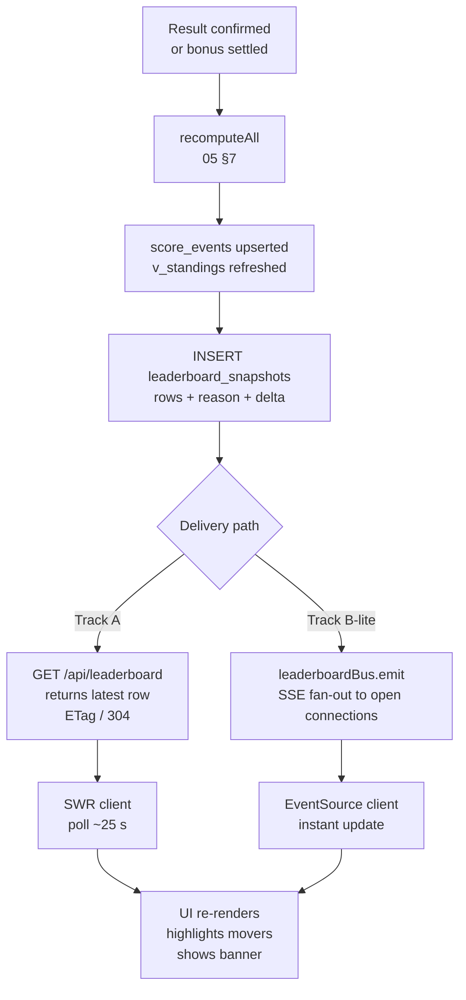

# 10 — Real-Time Leaderboard

Live standings for toto.icywhitephosphor.tech — design rationale, endpoint spec,
snapshot schema, progressive bonus display, and the optional SSE upgrade path.

---

## 1. What "live" actually means for a friends' pool

"Live" does **not** mean sub-second. The free football-data.org feed (see `08`) is itself
delayed 2–3 minutes by the provider. A recompute (see `05 §7`) runs once per result
confirmation event and takes well under a second for 21 participants × ~111 scorable
units. Delivering a freshened leaderboard within **1–3 minutes** of a goal being
scored is entirely sufficient — nobody needs to watch their rank update in real time.

This means:

- WebSockets are overkill and are **rejected**.
- A simple SWR/interval poll of a pre-computed snapshot endpoint is **sufficient and
  recommended** (Track A).
- SSE from an always-on VPS is an **optional nicety** (Track B-lite) if you want
  the table to flash without waiting for the next poll cycle.

> **Note on GPT's default suggestion:** the common AI-generated answer is SSE +
> Redis pub/sub. Redis pub/sub is unnecessary here — at ≤50 connections the app
> process can hold SSE connections and fan-out in-process after a recompute. We are
> running on a single always-on VPS (72.56.232.82), not a serverless fleet.

---

## 2. Options comparison

| # | Approach | How it works | Pros | Cons | Decision |
|---|----------|--------------|------|------|----------|
| **a** | **SWR/interval poll** `GET /api/leaderboard` every 20–30 s | Client fetches latest snapshot; server returns 304 if unchanged (ETag) | Zero server state; trivial to implement; 304s are cheap; works everywhere | Worst-case 30 s lag between recompute and browser update | **RECOMMENDED (Track A)** |
| **b** | **SSE** `GET /api/leaderboard/stream` pushed after recompute | Worker fires in-process event; app fans out to open SSE connections | Near-instant UX update; no polling overhead; simple on always-on VPS; no Redis needed | Long-lived connections need keep-alive; reconnect logic on client; slightly more code | Optional nicety (Track B-lite) |
| **c** | **WebSocket** | Bidirectional persistent socket | Sub-second latency | Completely unnecessary; adds infra complexity; requires socket server or sticky sessions | **Rejected** |

Tracks A and B-lite are **composable**: ship A first, add B-lite later. Clients that
support SSE switch to the stream; older or low-bandwidth clients keep polling.

---

## 3. Recompute → snapshot → serve model

Never compute standings live on the HTTP request path. A recompute might run
concurrently with a read, producing a partially-written state. Instead:

```
recomputeAll() writes a complete leaderboard_snapshots row
  → GET /api/leaderboard reads the LATEST row (by generated_at DESC LIMIT 1)
  → client receives a consistent, atomic snapshot
```

This is the same pattern already in `05 §7` and `04 §6`: `v_standings` feeds
`recomputeAll`, which `INSERT`s into `leaderboard_snapshots`. The HTTP handler never
touches `score_events` or `v_standings` directly.

### 3.1 Snapshot JSON schema

The `leaderboard_snapshots.rows` column stores a JSON array. Each element:

```ts
interface LeaderboardRow {
  place:                number;          // 1-based; ties share a place
  participant_id:       string;          // UUID — matches participants.id
  display_name:         string;          // "Гулькин Иван"
  total_points:         number;
  match_points:         number;
  bonus_points:         number;          // settled categories only; pending = 0
  playoff_match_points: number;          // tiebreaker 2 — R32..FINAL match bets
  key_bonus_points:     number;          // tiebreaker 3 — QF_PARTICIPANT..CHAMPION
  prize:                string | null;   // "1st – 6 000 ₽" | null
  delta_vs_previous:    number | null;   // point diff vs prior snapshot; null = first
  bonus_breakdown:      BonusCategoryLine[];  // one entry per category
  changed_matches:      string[];        // human-readable e.g. "Match 73 (QF1): 2:1"
}

interface BonusCategoryLine {
  category_id:   string;          // 'GROUP_WINNER' | 'FINALIST' | ...
  name_ru:       string;          // display label
  points:        number;          // 0 if not yet settled
  status:        'SETTLED' | 'PENDING';
  settles_after: string;          // stage label e.g. "QF" — shown when PENDING
}
```

The top-level snapshot envelope stored in `leaderboard_snapshots.rows` is this array;
the `reason` column (e.g. `"match 73 confirmed"`) is stored separately and echoed in
the HTTP response.

### 3.2 HTTP endpoint

```
GET /api/leaderboard
  → 200 application/json
      { snapshot_id, generated_at, reason, rows: LeaderboardRow[] }
  → 304 Not Modified  (if ETag matches)

Response headers:
  ETag: "<snapshot_id>"
  Last-Modified: <generated_at as RFC7231>
  Cache-Control: public, max-age=25, stale-while-revalidate=60
```

SWR sends `If-None-Match` automatically; the server compares to `snapshot_id` of the
latest row. A 304 response has no body — polling at 20–30 s costs almost nothing when
nothing has changed.

---

## 4. When recompute runs

Recompute (defined in `05 §7`) is triggered by the following events. All write a new
`leaderboard_snapshots` row on completion.

| Event | Source | Link |
|-------|--------|------|
| Group match result confirmed | Admin confirms `AWAITING_CONFIRM → FINAL` (see `08`) | `05 §7` |
| Play-off result confirmed | Admin confirms play-off result (toto score, pen winner) | `05 §7`, `08` |
| Bonus category settled | Admin writes `bonus_outcomes` for a category | `05 §4` |
| Admin override / manual recompute | `POST /api/admin/recalculate` (see `06`) | `05 §7` |

**Debounce:** if two results are confirmed within a short window (e.g. the admin confirms
three group matches rapidly), debounce the recompute trigger with a 2–5 s delay so a
single recompute covers all of them. Implement with a per-tournament mutex / queued
job; do not run concurrent recomputes.

---

## 5. Progressive bonus display

Bonus categories settle progressively (see `05 §4` and `BONUS_SETTLES_AFTER`). Until a
category's trigger stage completes, its contribution to `bonus_points` is **0** — this
is correct behaviour, not a bug.

The `bonus_breakdown` array in each `LeaderboardRow` communicates this explicitly:

```json
[
  { "category_id": "GROUP_WINNER",    "name_ru": "Победители групп",    "points": 18, "status": "SETTLED",  "settles_after": "GROUP" },
  { "category_id": "R16_PARTICIPANT", "name_ru": "Участники 1/8",       "points": 0,  "status": "PENDING",  "settles_after": "R32"   },
  { "category_id": "QF_PARTICIPANT",  "name_ru": "Участники 1/4",       "points": 0,  "status": "PENDING",  "settles_after": "R16"   },
  { "category_id": "SF_PARTICIPANT",  "name_ru": "Участники 1/2",       "points": 0,  "status": "PENDING",  "settles_after": "QF"    },
  { "category_id": "FINALIST",        "name_ru": "Финалисты",           "points": 0,  "status": "PENDING",  "settles_after": "SF"    },
  { "category_id": "CHAMPION",        "name_ru": "Чемпион",             "points": 0,  "status": "PENDING",  "settles_after": "FINAL" },
  { "category_id": "TOP_SCORER",      "name_ru": "Лучший бомбардир",    "points": 0,  "status": "PENDING",  "settles_after": "FINAL" }
]
```

The UI renders `SETTLED` rows in the normal colour and `PENDING` rows greyed out with
a label like "после R32". This prevents user confusion ("why does Иван have only 18
bonus points?") — they can see exactly which categories are still open.

---

## 6. "What changed" UX

Each snapshot includes `changed_matches` and the top-level `reason`. The UI can use
these to surface a transient banner:

```
"Иван +4, теперь 1 место — Match 97 (SF): Аргентина 2:1 Франция"
```

Implementation:

1. After recompute, compare the new ranked rows against the previous snapshot's rows.
2. For each participant, compute `delta_vs_previous = new.total_points - prev.total_points`.
3. Find place changes: `place_change = prev.place - new.place` (positive = moved up).
4. Store `changed_matches` as a string array in `leaderboard_snapshots.rows` (per-row)
   or at the envelope level. The `reason` column already records the match/event label.

The client reads the new snapshot on each poll cycle and compares `snapshot_id` to what
it last rendered; any change triggers an animation and the banner.

---

## 7. Optional SSE design (Track B-lite)

Since the app runs on an always-on VPS, keeping open HTTP connections is cheap and
straightforward. No Redis, no message broker, no extra process.

### Architecture

```
recomputeAll() completes
  → emits in-process event: leaderboard:updated { reason, snapshot }
  → SSE handler fans out to all open Response streams
  → client receives { event: "leaderboard", data: JSON }
```

### Server (Next.js Route Handler — App Router)

```ts
// app/api/leaderboard/stream/route.ts
import { NextRequest } from 'next/server';
import { leaderboardBus } from '@/lib/leaderboardBus'; // EventEmitter singleton

export const dynamic = 'force-dynamic';

export async function GET(_req: NextRequest) {
  const encoder = new TextEncoder();
  let cleanup: () => void;

  const stream = new ReadableStream({
    start(controller) {
      // Send current snapshot immediately on connect
      getLatestSnapshot().then(snap => {
        controller.enqueue(encoder.encode(`event: leaderboard\ndata: ${JSON.stringify(snap)}\n\n`));
      });
      // Keep-alive every 25 s
      const keepAlive = setInterval(() => {
        controller.enqueue(encoder.encode(': keep-alive\n\n'));
      }, 25_000);
      // Subscribe to in-process updates
      const onUpdate = (snap: unknown) => {
        controller.enqueue(encoder.encode(`event: leaderboard\ndata: ${JSON.stringify(snap)}\n\n`));
      };
      leaderboardBus.on('updated', onUpdate);
      cleanup = () => {
        clearInterval(keepAlive);
        leaderboardBus.off('updated', onUpdate);
      };
    },
    cancel() { cleanup?.(); },
  });

  return new Response(stream, {
    headers: {
      'Content-Type':  'text/event-stream',
      'Cache-Control': 'no-cache, no-transform',
      'Connection':    'keep-alive',
      'X-Accel-Buffering': 'no',   // disable Nginx buffering
    },
  });
}
```

### Client (SWR + SSE fallback)

```ts
// Default: SWR polling (Track A, always enabled)
const { data } = useSWR('/api/leaderboard', fetcher, { refreshInterval: 25_000 });

// Optional: replace polling with SSE when available
useEffect(() => {
  if (typeof EventSource === 'undefined') return;
  const es = new EventSource('/api/leaderboard/stream');
  es.addEventListener('leaderboard', (e) => mutate(JSON.parse(e.data), false));
  es.onerror = () => es.close(); // SWR polling takes over on disconnect
  return () => es.close();
}, []);
```

### Why no Redis at ≤50 connections

At 21 participants (generous: say 50 simultaneous browser tabs), each SSE connection
is a single `EventEmitter` subscription and a long-lived `Response` body. The in-process
`EventEmitter` fan-out is O(n) and completes in microseconds. Redis pub/sub adds a
network round-trip, serialisation overhead, and an external dependency — none of which
are justified until you scale beyond a single process.

### Reconnect / backoff

The browser `EventSource` API reconnects automatically with a 3 s delay. The server
sends the current snapshot on every new connection, so a reconnecting client is always
up-to-date within one round-trip regardless of what it missed.

---

## 8. Consistency and failure modes

| Scenario | Behaviour |
|----------|-----------|
| Recompute in progress while poll arrives | Handler reads `leaderboard_snapshots` — always sees the last committed row; in-progress transaction is invisible until committed |
| Recompute fails (exception, DB error) | No new snapshot is written; clients continue serving the last good row; error is logged and an alert fires |
| Two rapid result confirmations | Debounce (§4) ensures a single recompute covers both; at worst one extra recompute runs |
| SSE connection dropped | Client `EventSource` reconnects; receives current snapshot on reconnect; polling fallback continues covering the gap |
| Stale snapshot during low-activity periods | `Cache-Control: stale-while-revalidate=60` lets clients serve from cache; the next poll revalidates |
| Admin manual recompute (`/api/admin/recalculate`) | Generates a new snapshot with `reason = "manual recompute"`; all clients pick it up on next poll/SSE push |

---

## 9. Flow diagram



---

## Summary

| Item | Decision |
|------|----------|
| Default delivery | SWR polling `GET /api/leaderboard` every 20–30 s |
| Freshness SLA | ~1–3 min (matches the provider feed delay) |
| Snapshot source | `leaderboard_snapshots` latest row — never live from `v_standings` |
| Progressive bonus | `bonus_breakdown[]` with `status: PENDING/SETTLED` per category |
| "What changed" | `delta_vs_previous`, `changed_matches`, `reason` in every snapshot |
| Optional push | SSE via in-process `EventEmitter`; no Redis; ≤50 connections fine |
| WebSocket | Rejected — overkill for this scale |
