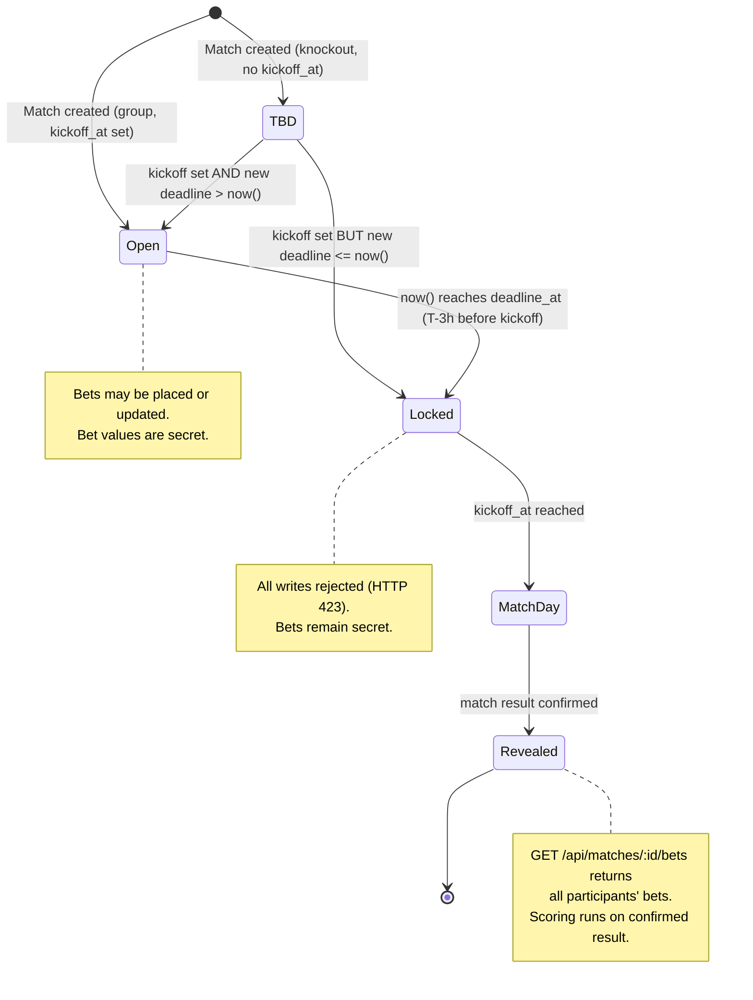

# 11 — Deadlines, Time Model, and Edge-Case Catalogue

All timestamps stored as `timestamptz` (UTC). Displayed in `Europe/Moscow` (MSK = UTC+3, no DST).
Server clock is authoritative. Client countdowns are cosmetic only.

---

## 1. Time Model

### 1.1 Why UTC storage + MSK display

World Cup 2026 venues span three countries (USA, Canada, Mexico) across many local time zones.
Storing UTC lets the database do all arithmetic unambiguously: `now() < deadline_at` is a plain
timestamptz comparison regardless of venue location. We never store "2026-06-11 17:00 Central" —
we store `2026-06-11T20:00:00Z` and display it.

All provider data arrives as UTC instants. Venue local times are a display convenience only; the
server never uses them for deadline math.

**Display timezone:** `tournaments.display_tz = 'Europe/Moscow'`. All times shown in the UI are
formatted with `Intl.DateTimeFormat` in `Europe/Moscow`. MSK has **no daylight-saving transitions**,
so the UTC+3 offset is constant for the entire tournament (June–July 2026). The conversion is always:

```
display_time_MSK = utc_instant + 3 hours
```

### 1.2 Bonus deadline constant

```
bonus_deadline_at = '2026-06-10T20:00:00Z'   -- 23:00 MSK, eve of the opening match
```

Stored once in `tournaments` for `id = 'wc2026'`. The server reads it with a single `SELECT`; the
`/api/bootstrap` response delivers it to the client. The value is fixed and never recomputed.

### 1.3 All timestamps in the API

Every response includes `"server_time"` in ISO 8601 UTC. Clients use this value — not their local
clock — to calibrate countdowns and determine whether a deadline has already passed. See `06` §1.2.

---

## 2. Match-Deadline Computation

### 2.1 Formula

```
matches.deadline_at = matches.kickoff_at - tournaments.match_deadline_lead
```

`match_deadline_lead` is an `interval` stored on the `tournaments` row, defaulting to `'3 hours'`
for `wc2026`. Example:

```
kickoff_at  = 2026-06-11T20:00:00Z   (= 23:00 MSK)
deadline_at = 2026-06-11T17:00:00Z   (= 20:00 MSK)
```

### 2.2 Generated column vs. recompute-on-import

`deadline_at` is **not** a PostgreSQL generated column because its formula spans two tables
(`matches` and `tournaments`). Instead it is computed in application code every time `kickoff_at` is
written (import, admin override, reschedule) and stored explicitly:

```typescript
const deadline = new Date(kickoff.getTime() - leadMs);
// where leadMs = intervalToMs(tournament.match_deadline_lead)  // 3 * 60 * 60 * 1000
```

A composite index `ON matches (deadline_at)` serves the enforcement query efficiently.

### 2.3 Kickoff TBD — knockout matches

Knockout brackets (R32 through FINAL) are seeded with `home_slot`/`away_slot` placeholder strings
(e.g., `'W73'`, `'L101'`). Before the bracket resolves, `kickoff_at IS NULL` and therefore
`deadline_at IS NULL`.

**Rule:** a match with `deadline_at IS NULL` is **not open for bets**. The API rejects any bet
attempt with `422 MATCH_NOT_OPEN`:

```typescript
if (match.deadline_at === null) {
  reject({ status: 'MATCH_NOT_OPEN', reason: 'Kickoff not yet scheduled' });
}
```

**Rule:** when `kickoff_at` is first set (e.g., during a fixture import after the Round of 32
bracket resolves), `deadline_at` is computed and the match becomes open **only if** the new
deadline is in the future:

```typescript
const nowUtc = new Date();
const deadline = new Date(kickoff.getTime() - leadMs);
if (deadline <= nowUtc) {
  // Kick-off was set but deadline already passed — lock immediately, log warning.
  match.deadline_at = deadline;
  audit_log({ action: 'KICKOFF_SET_ALREADY_LOCKED', ... });
} else {
  match.deadline_at = deadline;   // opens betting
}
```

**UI:** for a TBD match the client shows "Ставки откроются после определения пар" and hides the
bet form entirely. Once `deadline_at` is set and in the future, the form appears with a countdown.

---

## 3. Server-Authoritative Enforcement

### 3.1 Enforcement pseudocode

Every write to `match_bets` executes the following gate before touching the DB:

```typescript
async function assertBetOpen(matchId: string, db: DB): Promise<void> {
  const { deadline_at, status } = await db.queryOne(
    `SELECT deadline_at, status FROM matches WHERE id = $1`, [matchId]
  );

  if (deadline_at === null) {
    throw new AppError(422, 'MATCH_NOT_OPEN', 'Kickoff not yet scheduled');
  }

  // Server clock only — never trust client-supplied time
  const nowUtc: Date = new Date();  // equivalent to now() in PostgreSQL

  if (nowUtc >= deadline_at) {
    throw new AppError(423, 'LOCKED', 'Match deadline has passed', { deadline_at });
  }

  if (status === 'CANCELLED') {
    throw new AppError(422, 'MATCH_CANCELLED', 'Match was cancelled');
  }
}
```

For bonus bets the equivalent check is:

```typescript
const { bonus_deadline_at } = await db.queryOne(
  `SELECT bonus_deadline_at FROM tournaments WHERE id = 'wc2026'`
);
if (new Date() >= bonus_deadline_at) {
  throw new AppError(423, 'BONUS_DEADLINE_PASSED', 'Bonus deadline has passed');
}
```

### 3.2 HTTP 423 response shape

```json
{
  "server_time": "2026-06-11T17:05:00.000Z",
  "error": {
    "code": "LOCKED",
    "message": "Match deadline has passed",
    "detail": { "deadline_at": "2026-06-11T17:00:00.000Z" }
  }
}
```

### 3.3 Clock-skew note

The client countdown is derived from `server_time` returned in each API response. A client whose
local clock is ahead by 30 seconds might show the deadline as expired slightly before the server
agrees. Conversely a lagging client may let the user click "Save" after the server has already
locked — the server rejects the write with 423 and the client surfaces the error. **Server is
truth; client countdown is cosmetic.** The VPS at `72.56.232.82` must remain NTP-synchronized
(e.g., `systemd-timesyncd` or `chrony`). Monitor clock drift in alerting (`12`).

---

## 4. Reschedules

When the provider reports a changed `kickoff_at` the import worker (or admin via
`PATCH /api/admin/matches/:id`) recomputes `deadline_at` and writes an audit log entry:

```typescript
const newDeadline = new Date(newKickoff.getTime() - leadMs);
await db.transaction(async (tx) => {
  await tx.query(
    `UPDATE matches SET kickoff_at=$1, deadline_at=$2, updated_at=now() WHERE id=$3`,
    [newKickoff, newDeadline, matchId]
  );
  await insertAuditLog(tx, {
    action: 'KICKOFF_RESCHEDULED',
    entity_type: 'match',
    entity_id: matchId,
    before: { kickoff_at: oldKickoff, deadline_at: oldDeadline },
    after:  { kickoff_at: newKickoff, deadline_at: newDeadline },
    reason,
  });
});
// Optionally: enqueue a notification to participants if the change is significant (>1 hour).
```

**Moved earlier — new deadline already in the past:**
The match locks immediately. Any bets placed before the original deadline remain valid and will be
scored normally. No existing bets are deleted or invalidated. The audit log records the event with
`reason: 'KICKOFF_MOVED_EARLIER_LOCKED_IMMEDIATELY'`.

**Moved later — new deadline in the future:**
Betting reopens. Participants who had already submitted a bet may update it until the new deadline.
The audit log records `'KICKOFF_MOVED_LATER_REOPENED'`. The UI shows a reopened countdown.

---

## 5. Partial-Save Semantics

`PUT /api/me/match-bets` processes each bet in the request array independently (see `06` §3.8).
A single locked match does not block the others:

```
Request:  bets = [match_A (open), match_B (locked), match_C (open)]

Response:
  saved:    [{ match_id: A, status: "SAVED", version: 2 },
             { match_id: C, status: "SAVED", version: 1 }]
  rejected: [{ match_id: B, status: "LOCKED",
               deadline_at: "2026-06-18T11:00:00.000Z",
               reason: "Match deadline has passed" }]
```

The response HTTP status is always `200` even when some bets were rejected; the `rejected` array
conveys the per-bet failures. The client should highlight locked bets individually, not abort the
whole save.

Possible `rejected.status` values: `LOCKED`, `MATCH_NOT_FOUND`, `MATCH_NOT_OPEN`,
`X2_NOT_ALLOWED`, `INVALID_SCORE`, `PEN_WINNER_REQUIRED`, `PEN_WINNER_DISALLOWED`,
`VERSION_CONFLICT`.

---

## 6. Reveal Timing

Bets are **secret until their deadline passes**. The reveal endpoints gate on the server clock:

| What is revealed | Endpoint | Gate |
|---|---|---|
| All participants' bets for one match | `GET /api/matches/:id/bets` | `now() >= matches.deadline_at` |
| All participants' bonus bets | `GET /api/bonus/reveal` | `now() >= tournaments.bonus_deadline_at` |

Before the deadline the server returns `403 REVEAL_BEFORE_DEADLINE`. After the deadline the full
bet matrix is returned, including participants who placed no bet (shown with `pred_home: null`).

The leaderboard does not reveal individual bets — it only shows aggregated points. Bet details
become visible only via the explicit reveal endpoints above, and only post-deadline.

---

## 7. Deadline Lifecycle Diagram



---

## 8. Edge-Case Catalogue

| # | Case | Expected Behaviour |
|---|---|---|
| 1 | User opens bet form before deadline; network is slow; click "Save" arrives after `deadline_at` | Server checks `now() >= deadline_at` at write time; returns 423 `LOCKED`. Client displays "Deadline passed, bet not saved." |
| 2 | Client clock is ahead of server by up to ~60 s | Countdown may reach zero early; user clicks Save; server may still accept (server clock has not reached deadline). Server is truth. |
| 3 | Client clock is behind server by up to ~60 s | Countdown still running; user clicks Save; server rejects with 423. Client shows error and refreshes `server_time` from response. |
| 4 | Match kicks off earlier than originally scheduled | Provider sends updated `kickoff_at`. Import worker recomputes `deadline_at`. If new deadline is already past, match locks immediately; existing valid bets stand. |
| 5 | Match postponed (kickoff moved later) | New `deadline_at` in the future; betting reopens; audit log records `KICKOFF_MOVED_LATER_REOPENED`; participants may revise bets. |
| 6 | Match abandoned / cancelled | Admin sets `matches.status = 'CANCELLED'` and `match_results.result_status = 'CANCELLED'`. Scoring engine excludes it (`05` §8). Existing bets are kept for audit but score 0. Admin may communicate the ruling per `01` §7.2. |
| 7 | Provider sends wrong kickoff time; admin corrects manually | Admin uses `PATCH /api/admin/matches/:id` to set correct `kickoff_at`; server recomputes `deadline_at`; audit log records before/after with `source='ADMIN'`. |
| 8 | Double-submit (user clicks Save twice rapidly) | `idempotency_key` (UUID v4 sent by client) deduplicates: second request returns cached first response within 24 h. Without idempotency key: upsert is safe; `version` increments once per actual change. |
| 9 | ×2 toggled ON after deadline | Bet write rejected with `LOCKED` (×2 is part of the bet payload; the whole bet is atomic). The prior bet without ×2 remains. |
| 10 | User tries to edit a locked bet | `PUT /api/me/match-bets` returns `rejected[{ status: "LOCKED" }]` for that match. Stored bet is immutable. |
| 11 | Participant submits no bet for a match | `scoreMatchBet(stage, null, toto) = 0` (see `05` §3). No penalty, no row required; `GET /api/matches/:id/bets` shows `pred_home: null` for that participant. |
| 12 | Leap second at deadline boundary | PostgreSQL `timestamptz` arithmetic absorbs leap seconds via the system `libc`/UTC representation. The boundary comparison `now() >= deadline_at` may be off by at most 1 second. For a 3-hour window this is immaterial. |
| 13 | User in a DST-observing timezone (e.g., Central European Summer Time = UTC+2) confused about deadline | UI always shows deadline in MSK with explicit label "МСК (UTC+3)". The `deadline_at` field is also exposed in UTC so any sufficiently motivated user can convert. |
| 14 | Bracket placeholder match — teams not yet known | `home_team_id IS NULL`, `kickoff_at IS NULL`, `deadline_at IS NULL`. API returns `MATCH_NOT_OPEN` (422). UI hides the bet form and shows "Команды ещё не определены". |
| 15 | Two browser tabs for the same user racing to save the same bet | Both send `version: 1`. First write succeeds, increments version to 2. Second write gets `VERSION_CONFLICT` in `rejected`. UI prompts the user to reload and re-enter. Without version field: last-write-wins (safe for 21-user pool). |
| 16 | Bonus bet saved, then user tries to update after bonus deadline | `PUT /api/me/bonus-bets` returns 423 `BONUS_DEADLINE_PASSED`. Original bonus bet stands unchanged. |
| 17 | Admin reschedules a match whose deadline was already past | Allowed admin action. If new deadline is in the future: bets reopen, audit log records `KICKOFF_MOVED_LATER_REOPENED`. Any bets placed before the original deadline remain; participants may now add or update bets until the new deadline. |
| 18 | Two simultaneous provider syncs (e.g., cron overlap) | Import uses `UPSERT ... ON CONFLICT (tournament_id, fifa_match_no) DO UPDATE`. Race is safe. The second upsert overwrites with the same values; audit log may write a duplicate entry, which is harmless. |
| 19 | Provider sync delivers a `kickoff_at` change for a FINAL-status match with `force=false` | Import skips the row (`force=false` skips already-FINAL matches). Admin can override via `PATCH /api/admin/matches/:id` if needed. |
| 20 | Knockout match gets teams assigned mid-day, with under 3 h to kickoff | `deadline_at = kickoff_at - 3h` is already in the past when computed. Match locks immediately, zero time for bets. Audit log records `KICKOFF_SET_ALREADY_LOCKED`. UI shows "Ставки закрыты — матч начнётся менее чем через 3 часа". |
| 21 | User's session JWT expires mid-session while filling bets | Bet save returns 401 `UNAUTHENTICATED`. Client redirects to Telegram auth; after re-login, the prefilled form is still in memory (client-side state) and can be submitted again — provided the deadline has not passed. |
| 22 | Admin manually sets `result_status = 'CANCELLED'` after bets were already revealed | Bets remain visible (reveal gate is the deadline, not the result). Scoring engine produces 0 for all participants on that match. Leaderboard snapshot is regenerated. |

---

*Cross-references: `04` (schema — `matches.deadline_at`, `kickoff_at`, `tournaments.bonus_deadline_at`, `match_deadline_lead`), `05` (scoring — cancelled/no-bet edge cases), `06` (API — partial-save, 423 response shape, reveal endpoints), `08` (provider sync and fixture import), `12` (ops — NTP monitoring).*
