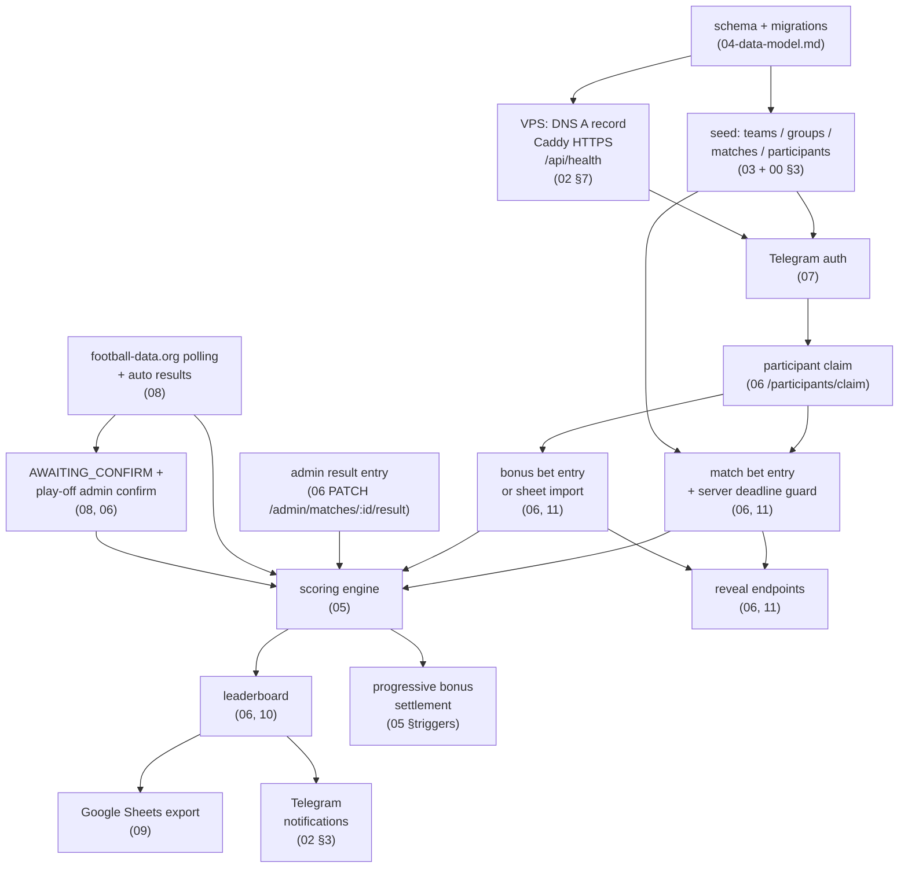

# 13 — MVP Plan and Build Order

> Audience: whoever is building this (likely ione, solo). Today is **2026-06-09**.
> Cross-references: architecture docs `00`–`12`; all table names and API paths use the canon in `00` §2.

---

## 1. Reality check — the bonus deadline is tomorrow

The bonus-bet deadline is **2026-06-10 23:00 MSK**, roughly 36 hours away.

A complete web app with Telegram auth, a working bet UI, server-side deadline enforcement, scoring, a
leaderboard, and a Google Sheets export is **not deliverable in 36 hours by a solo developer**, even with
all the architecture docs written. The temptation to try anyway is real — resist it. A half-baked app that
loses bets, applies the wrong deadline, or stores bonus picks without enforcing secrecy would be worse
than no app at all.

The pragmatic call: **collect bonus bets for this tournament the way you always have** — via the shared
`тотоЧМ2026.xlsx` sheet and/or Telegram — and use the next five-plus weeks of match betting (11 June to
19 July) to ship the app properly. You are not missing the tournament; you are missing one input session
that the group already knows how to do without software.

---

## 2. Phase 0 — Don't miss the deadline (do this now)

**Goal:** freeze bonus picks via the existing process; stand up the server so the domain is live and
infrastructure is validated before the first match.

**Definition of done:** `https://toto.icywhitephosphor.tech/api/health` returns `{"status":"ok"}`;
the bonus bets are recorded in the sheet; Postgres is running with teams, groups, matches, and all
21 participants seeded.

| Task | Effort | Ref |
|------|--------|-----|
| Announce in the group: bonus bets go to the sheet as usual, web app ships during group stage | 10 min | — |
| Add DNS A record `toto.icywhitephosphor.tech → 72.56.232.82` | 5 min | `02` §7 |
| Write `docker-compose.yml` (caddy + app stub + db), deploy stub, verify HTTPS | 2–3 h | `02` §7 |
| Run Drizzle/Prisma migrations for `teams`, `groups`, `matches` (matches 1–72 with kickoff times), `participants` | 3–4 h | `04` DDL, `03` seed data |
| Seed all 21 participants from `тотоЧМ2026.xlsx` (names + placeholder `telegram_id = null`) | 1 h | `00` §3 |
| Import bonus picks from the sheet into `bonus_bets` / `bonus_bet_items` after the 23:00 deadline passes | 1 h | `04`, `06` import endpoint |
| Register bot in BotFather; set domain to `toto.icywhitephosphor.tech`; note `BOT_TOKEN` | 30 min | `07` §2 |

**Total: ~1 working day of infrastructure.** None of this requires the UI or auth to be user-facing.

---

## 3. Phase 1 — MVP: match betting before the group stage ends

**Window:** group stage runs 11–27 June. First match is 11 June. You have roughly two weeks; aim to ship
before the first wave of matches, but even mid-group-stage is acceptable for this audience.

**Definition of done:** a participant can open the app in Telegram (or browser), claim their identity,
place a bet on an upcoming group-stage match before the T−3h deadline, and see the leaderboard update
after the admin enters the result via the admin panel.

| Feature | Key constraints | Ref docs |
|---------|-----------------|----------|
| Telegram Mini App auth (`/api/auth/telegram/miniapp`) + Login Widget fallback | HMAC must be verified server-side; session cookie, not JWT in localStorage | `07` |
| Participant claim (`/api/participants/claim`): bind `telegram_id` to one of the 21 roster entries | Reject if already claimed by another user; admin rebind | `06`, `07` |
| `/api/bootstrap`: return current user, open matches, deadline times | Single call on page load | `06` |
| Match bet entry UI + `PUT /api/me/match-bets` for GROUP stage | Server enforces deadline `kickoff − 3h`; client reflects but never enforces; idempotent upsert; audit_log entry | `06`, `11` |
| Bet secrecy: `GET /api/matches/:id/bets` returns own bets only until deadline passes | Core fairness requirement; not optional | `00` §TL;DR, `11` |
| Admin result entry: `PATCH /api/admin/matches/:id/result` (source=ADMIN) | Simple form; no automation yet | `06`, `08` |
| Scoring engine: compute `score_events` on result entry; update `leaderboard_snapshots` | Pure module, unit-tested against worked examples | `05` |
| Leaderboard page: poll `/api/leaderboard` every 20–30 s via SWR | No SSE needed; full recompute for 21 × 72 rows is instant | `10` |
| Bonus bet entry UI + `GET|PUT /api/me/bonus-bets` (if bonus bets not yet imported from sheet) | Lock at 2026-06-10 23:00 MSK; show locked state if past deadline | `06`, `11` |
| Import bonus bets from sheet (if UI not ready before deadline) | Admin-only endpoint; one-shot | `06` |
| Google Sheets export: `/api/admin/export/sheets` triggered manually | Private sheet only (secrecy); single tab is fine | `09` |

**Rough effort: 5–8 ideal developer-days** (single developer, focused, familiar with the stack).

---

## 4. Phase 2 — Automate and integrate

**Window:** start of group stage through end of Round of 32 (by ~3 July). These features reduce manual
admin work and add progressive bonus settlement.

**Definition of done:** results appear automatically after a group-stage match ends; play-off results
appear in `AWAITING_CONFIRM` and the admin can confirm/override in one click; bonus categories settle
progressively; reveal endpoints work correctly.

| Feature | Key constraints | Ref docs |
|---------|-----------------|----------|
| `node-cron` worker: poll football-data.org every 5 min during live windows | 10 req/min limit; store in `provider_sync_log`; write `match_results` with `source=PROVIDER` | `08` |
| Auto-trigger scoring recompute on result upsert | Scoring engine stays pure; worker calls it; write `score_events` | `05`, `08` |
| `AWAITING_CONFIRM` flow for play-off matches (R32–FINAL) | Provider result written but `confirmed=false`; admin confirms before points count | `08` §admin-confirm, `06` |
| Progressive bonus settlement endpoints: `PATCH /api/admin/bonus/:category/settle` | One per category, triggered after the relevant stage finishes | `05` §settlement-triggers, `06` |
| Reveal endpoints: `/api/matches/:id/bets` returns all bets post-deadline; `/api/bonus/reveal` post-bonus-deadline | Check server clock, not client | `06`, `11` |
| Bracket slot population: fill `home_team_id` / `away_team_id` in R32–FINAL matches from provider | Provider returns resolved fixtures; admin confirms 3rd-place assignments | `03` §4-5, `08` |

**Rough effort: 3–5 ideal developer-days.**

---

## 5. Phase 3 — Polish

**Window:** July (R16 through Final). Lower urgency; improves the experience.

| Feature | Notes | Ref docs |
|---------|-------|----------|
| Live-ish leaderboard refinement | SWR polling at 20 s is already "live enough"; optional SSE via `/api/leaderboard/stream` is a Track B upgrade only | `10` |
| Telegram bot notifications (match reminders, result alerts) | Nice to have; requires `TGBOT` integration; DMs only | `08`, `02` §3 |
| Reconciliation jobs: re-verify results at `+2h` and `+24h` after final whistle | Catches provider data corrections | `08` §reconciliation |
| Admin panel niceties: participant rebind, audit log view, sync log | `audit_log`, `provider_sync_log` tables already populated | `06`, `12` |
| Public Sheets tab: post-deadline rows visible to anyone with the link | Two-tab export (private + public); secrecy model in `09` | `09` |
| Full edge-case hardening: rescheduled matches, abandon, provider outage | Catalogue in `11`; admin override always remains the escape hatch | `11` |

**Rough effort: 2–4 ideal developer-days** (spread across the back half of the tournament).

---

## 6. Cut list: what to drop first under time pressure

### Non-negotiable (never cut)
- **Server-side deadline enforcement.** The client must not be the gate. A bet placed 1 s after T−3h must be rejected by the API.
- **Bet secrecy until deadline.** No endpoint may return another participant's open bet before its deadline passes.
- **Correct scoring.** The scoring engine must match the worked examples in `05` exactly. Ship with tests.
- **Auth that actually verifies the Telegram HMAC.** A fake identity defeats the whole pool.

### Cut first if time is short
| Feature | Why it is cuttable | Fallback |
|---------|--------------------|----------|
| SSE / WebSocket push | SWR polling at 20–30 s is indistinguishable for 21 users watching a score change | Already the plan; just confirm it is not built |
| Telegram bot notifications | The group chat already handles reminders | Skip entirely for Phase 1 |
| Multi-provider failover | football-data.org free tier + admin override covers all cases | Single provider only |
| Public Sheets tab | Start with one private sheet; add public tab later | Ship with private only |
| Fancy admin panel | A simple HTML form or even a direct admin endpoint with curl/Postman is enough for Phase 1 | Minimal form |
| Reconciliation jobs | Admin re-entry covers edge cases in a 21-person pool | Manual re-confirm |
| Bracket self-resolver (Annex C matrix) | Provider resolves brackets; admin confirms | Provider + admin is sufficient |
| Audit log UI | The `audit_log` table is being written; surface it later | Data is safe, just not visible |

---

## 7. If you only have 24–48 hours (minimum viable path)

This path gets bets open for the first group-stage matches. Everything else is Phase 2+.

1. **VPS + DNS + Caddy + `/api/health`** (2–3 h) — infrastructure must be live and HTTPS must work before
   any Telegram auth can be tested.
2. **DB schema + seed** (3–4 h) — run migrations for `teams`, `groups`, `matches` (matches 1–72),
   `participants`. Deadline fields on `matches` must be correct (`kickoff_at − 3h`).
3. **Telegram Mini App auth + participant claim** (3–4 h) — implement `07` §Mini App HMAC verification,
   session cookie, `/api/participants/claim`. Test end-to-end in a real Telegram webview.
4. **Bet entry + deadline guard** (4–5 h) — `PUT /api/me/match-bets` with the deadline check, idempotent
   upsert, and secrecy guard on the read path. A minimal React form is enough — no fancy UI.
5. **Admin result entry + scoring + leaderboard read** (4–5 h) — `PATCH /api/admin/matches/:id/result`,
   scoring engine (pure module from `05`), `/api/leaderboard`. The leaderboard can be a plain JSON
   endpoint with a basic table in the UI.

That is 16–21 hours of focused work and skips export, automation, notifications, bonus UI, and all Phase 2
features. It is enough to serve group-stage match betting from day one.

---

## 8. Build-order dependency graph

---

## 9. Phase → architecture doc mapping

| Phase | Features | Primary docs |
|-------|----------|-------------|
| 0 — Infrastructure | DNS, Caddy, Docker Compose, schema, seed | `02` §7, `04`, `03`, `12` |
| 0 — Bonus import | Sheet → DB import after deadline | `04`, `06` (import endpoint) |
| 1 — Auth | Telegram Mini App HMAC, session, claim | `07` |
| 1 — Bet entry | `PUT /api/me/match-bets`, deadline guard, secrecy | `06`, `11` |
| 1 — Bonus bet UI | `GET|PUT /api/me/bonus-bets`, lock at deadline | `06`, `11` |
| 1 — Admin result | `PATCH /api/admin/matches/:id/result` | `06`, `08` §manual-override |
| 1 — Scoring | `score_events`, `leaderboard_snapshots` | `05` |
| 1 — Leaderboard | `/api/leaderboard`, SWR poll | `10` |
| 1 — Export | `/api/admin/export/sheets`, private tab | `09` |
| 2 — Provider | `node-cron` poll, `provider_sync_log`, auto results | `08` |
| 2 — Play-off confirm | `AWAITING_CONFIRM`, admin confirm/override | `08`, `06` |
| 2 — Bonus settlement | `PATCH /api/admin/bonus/:category/settle` | `05` §settlement-triggers, `06` |
| 2 — Reveal | `/api/matches/:id/bets`, `/api/bonus/reveal` | `06`, `11` |
| 2 — Bracket | Populate R32–FINAL slots from provider | `03` §4-5, `08` |
| 3 — Polish | Reconciliation, notifications, public sheet, audit UI | `08`, `09`, `11`, `12` |

---

## 10. Key risks and mitigations

| Risk | Likelihood | Impact | Mitigation |
|------|:----------:|:------:|-----------|
| Bonus-bet deadline tomorrow; web app not ready | **Certain** | High | Phase 0: collect via sheet + Telegram as today; import into DB post-deadline |
| football-data.org returns wrong canonical score (ET/penalties) | Medium | High | All play-off results go through `AWAITING_CONFIRM`; admin confirms before points count (`08` §admin-confirm) |
| Provider assigns wrong penalty winner (+1 goal to wrong side) | Low | High | Admin always has `PATCH /api/admin/matches/:id/result` override with `source=ADMIN`; `confirmed=true` wins over provider |
| Third-placed team slot assignment wrong (495-combo logic) | Low | Medium | Provider resolves R32 fixtures with real team IDs; admin confirms; Annex C matrix is a fallback only (`03` §5) |
| Telegram HMAC implemented incorrectly (auth bypass) | Medium | Critical | `07` §2 documents both Mini App and Widget HMAC correctly; write a unit test against the Telegram test vector before any user-facing deploy |
| Participant claims wrong identity (someone else's name) | Low | Medium | Admin rebind endpoint (`/api/admin/participants/:id/rebind`); audit_log records every claim |
| VPS goes down during a match window | Low | Medium | Manual admin entry still works if provider polling is offline; Postgres volume is persistent (`12` backup policy) |
| Developer time overrun; app not ready for group stage start | Possible | Medium | Worst case: Phase 0 infrastructure is live, bonus bets are in DB, and the group can fall back to the sheet for group-stage bets too — the schema is already the source of truth |
| Match kickoff rescheduled after bets placed | Low | Medium | `11` §reschedule covers recomputing deadlines; deadline is always `kickoff_at − 3h` stored on the match row, not hardcoded |
| Google service account credentials leak | Low | High | Store `GOOGLE_SA_JSON` in `.env` root-only, never in the repo; rotate if leaked (`12` §secrets) |
